# Khai thác máy ảo Blocky Hackthebox
## Người thực hiện :Trần Minh Đức
### Bước 1: Reconnaissance
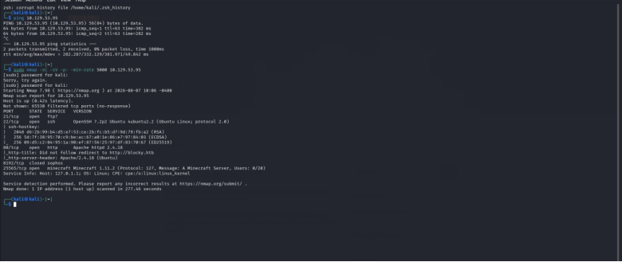
Đầu tiên. tôi đã sử dụng lệnh `sudo nmap -sC -sV -p- -min-rate 5000 <IP mục tiêu>` để lấy thông tin chi tiết về các cổng dịch vụ , version và default script trên máy nạn nhân. 
Tôi đã nhận được các thông tin ftp/21, ssh/22, 80/http, 8192closed, 25565/minecraft server. Và ta thấy cổng 80 đang dùng dịch vụ webserver Apache 2.4.18 
Vì có did not follow redirect to http://blocky.htb. Nên chúng ta sẽ phải ánh xạ ip và tên miền vào file /etc/hosts để truy cập được trang web. 
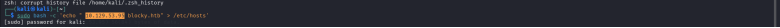
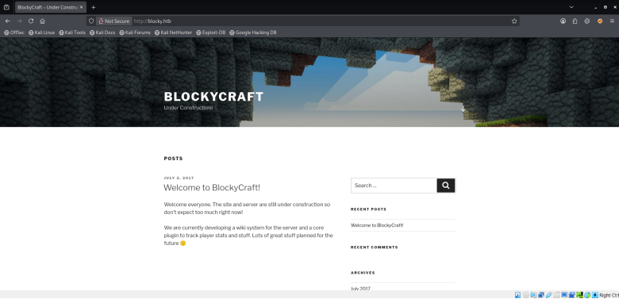
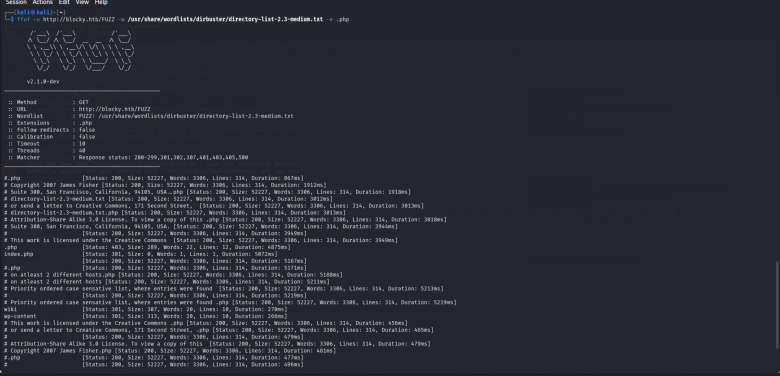
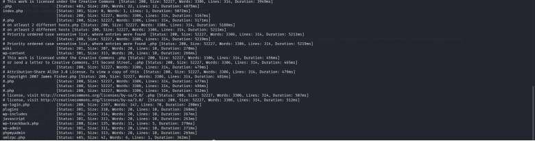
Tôi đã sử dụng lệnh `ffuf -u http://blocky.htb/FUZZ -w /usr/share/wordlists/dirbuster/directory-list-2.3-medium.txt -e .php` để dò tìm các thư mục và các tệp tin ẩn trên website
Và ở đây trong số các đường dẫn này tôi thấy có 2 đường dẫn là trang login là wp-admin và phpmyadmin. Bên cạnh đó đường dẫn plugins đã trả về cho chúng ta 2 file .jar
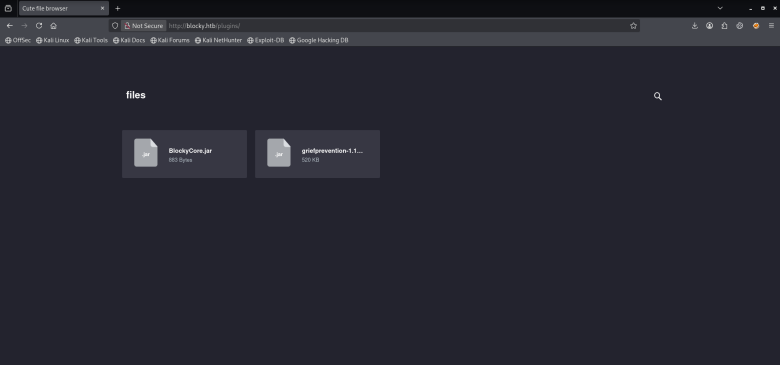
Tôi đã tải về và tải công cụ jd-gui để có thể đọc được các tệp tin này 
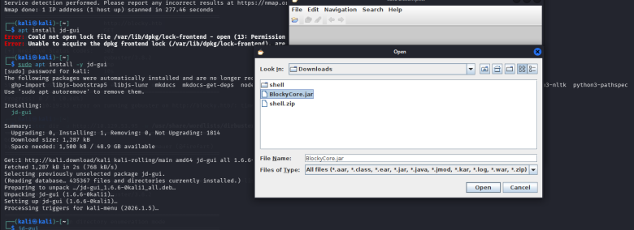
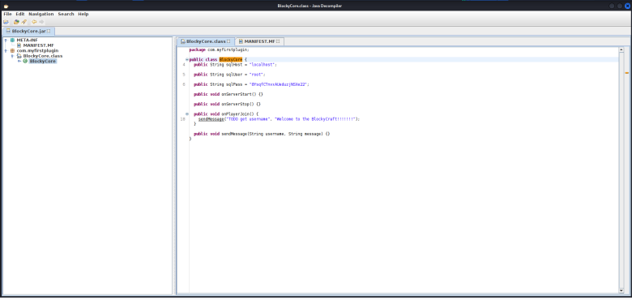
Trong file BlockyCore chúng ta thấy sqlUser=`root` và sqlPass=`8YsqfCTnvxAUeduzjNSXe22`
Từ tài khoản này tôi đã có thể login vào tài khoản quản lí database tại đường dẫn ` http://blocky.htb/phpmyadmin`
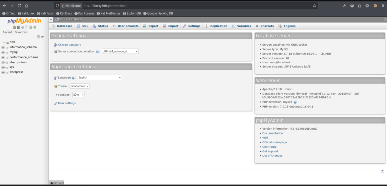
Sau khi xem qua phần lớn database tôi tìm được trong wordpress user có 1 account notch và pass ở dạng mã hóa. Đây sẽ là 1 tài khoản quản lí web. Tôi sẽ sử dụng công cụ john the ripper để tìm kiến từ điển và sử dụng từ điển rockyou.txt
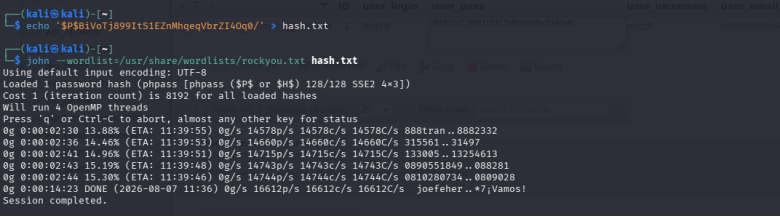
Nhưng hình như mật khẩu này là 1 mật khẩu khá phức tạp và k có trong từ điển nên tôi đã nhớ đến mật khẩu bên trên tôi sử dụng để vào database và đã có thể ssh thành công vào tài khoản ngừời dùng `Notch `
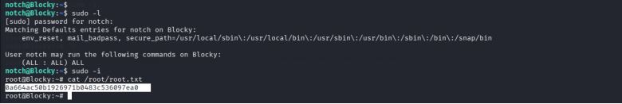
Khi vào tài khoản này và sudo -l tôi thấy nó đã được trao full quyền root  một cách rất khó hiểu và tôi chỉ cần sudo -i để leo lên root
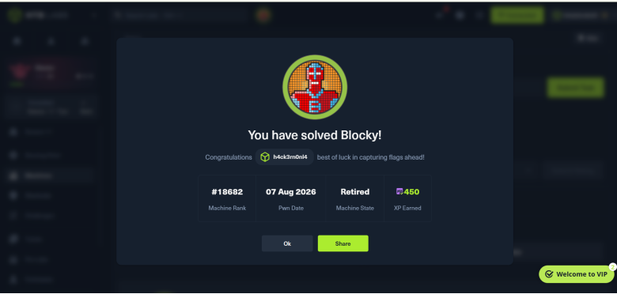
