# Khai thác máy ảo Cap Hackthebox
## Người thực hiện :Trần Minh Đức
### Bước 1: Reconnaissance
Giai đoạn 1: Reconnaissance
Đầu tiên ta sẽ check xem kết nối open vpn tới máy chủ của chúng ta đã ok chưa bằng cách ping trực tiếp tới máy nạn nhân 10.129.45.89 
Sau đó chúng ta sẽ check sơ qua bằng công cụ nmap để xem qua các port đang mở và dịch vụ máy nạn nhân đang sử dụng bằng câu lệnh sudo nmap -sC -sV 10.129.45.89

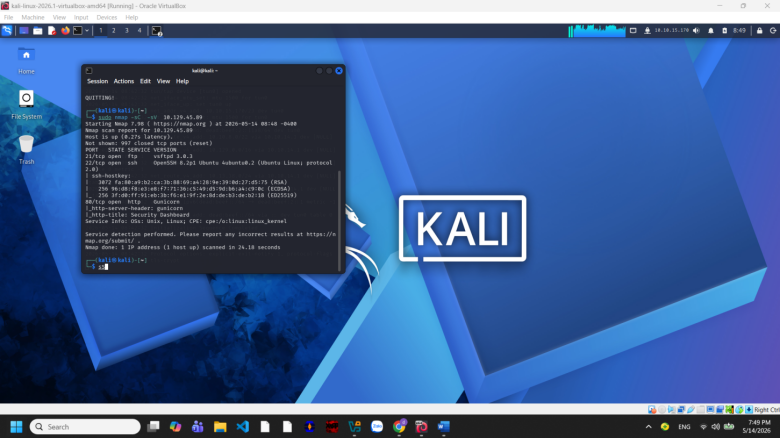

Sau khi nhận được kết  quả là máy nạn nhân đang sử dụng dịch vụ ftp/21 ssh/22 và dịch vụ web http/ port80 ta sẽ thử truy cập giao diện web Ở đây chúng ta thấy web này là 1 security dashbash 

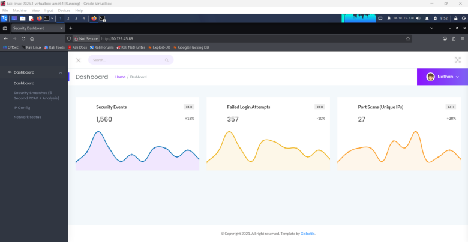

Sau đó chúng ta thấy ở phần máy nạn nhân có thể tải được các file data và chúng ta có thể sửa id đằng sau /data/id để đến các file data khác và tải xuống . Trong các file này em có check qua trên whireshark full và nhận ra nó hình như là các file thoại tcp giữa user và web server để đăng nhập . Và có lẽ việc sửa id đằng sau là đang sửa để xem thông tin của user khác 

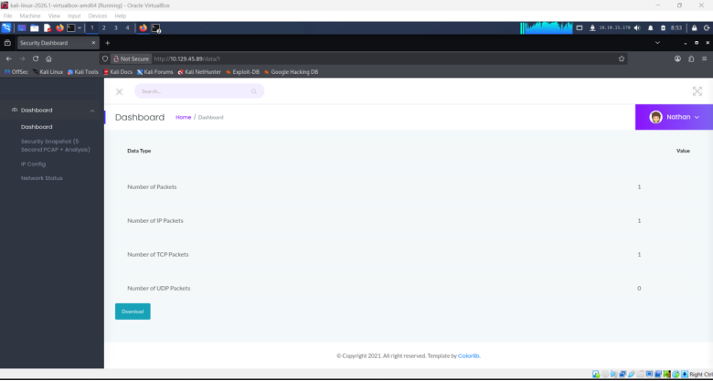
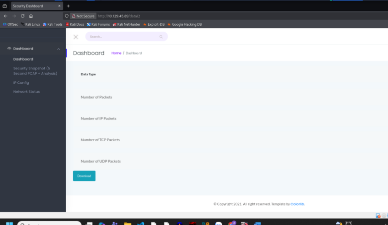

Sau khi check hết 5 file từ gói tin thì duy nhất file có id là 0 có để lộ trường mật khẩu và trường user name 

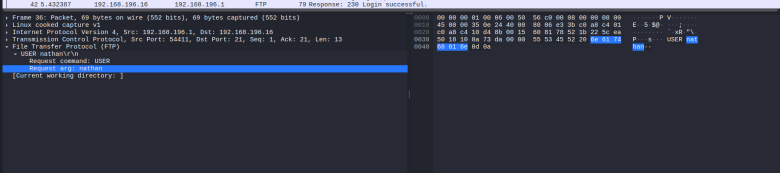

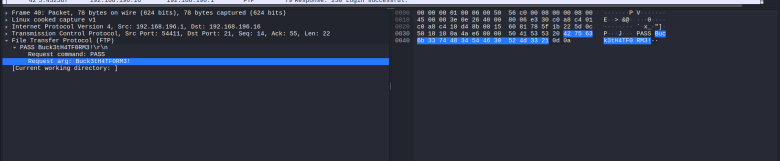

Do máy có sử dụng ssh và chúng ta đã có username kèm password giờ chúng ta sẽ truy cập vào máy bằng dịch vụ ssh

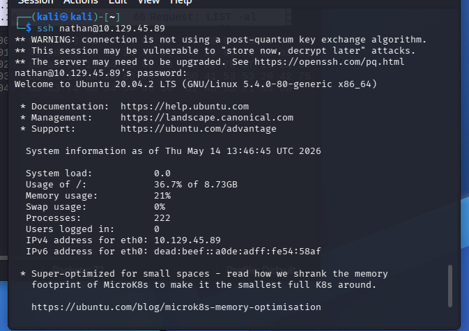

Giai đoạn 2: Exploitation

Sau khi vào dc tài khoản của user ta sẽ tìm dc file user.txt và submit dc cờ ở trong tài khoản user

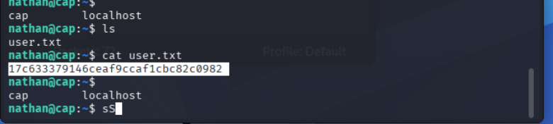

Như chúng ta đã biết khi nmap máy này sử dụng apache làm web server	nên cta sẽ xem file /var/www/html để check thư mục gốc của trang và ta thấy file app.py đây sẽ là file code chính của web

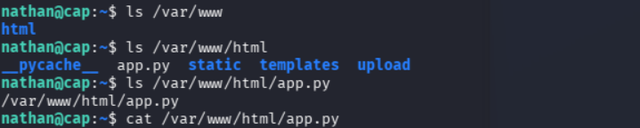

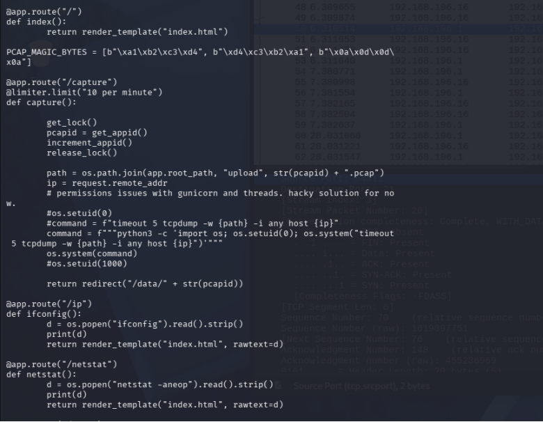

Và khi truy cập vào file ta dễ dàng thấy ở phần trong ảnh có dòng python 3 … os.setuid(0) ta thấy là nó sử dụng code python và có thể thay đổi dc userid bằng lệnh os đơn giản kia 

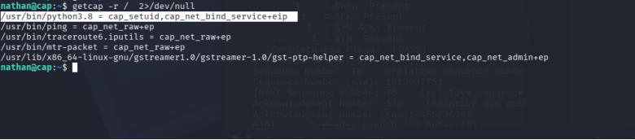
