# Khai thác máy ảo Abducted Hackthebox
## Người thực hiện :Trần Minh Đức
### Bước 1: Reconnaissance

Đầu tiên chúng ta sẽ sử dụng lệnh:
`sudo nmap -sC -sV -min-rate 5000 <IP mục tiêu>` để quét tất cả các port của máy mục tiêu để lấy về các thông tin dịch vụ , version, script trên ip mục tiêu . Ta thấy có dịch vụ ssh/22,http/80,MCP-Jam/6274.
MCP-Jam-Inspector là 1 công cụ debugging/inspection tool dành cho lập trình viên xây dựng và tích hợp các ứng dụng sử dụng giao thức MCP.
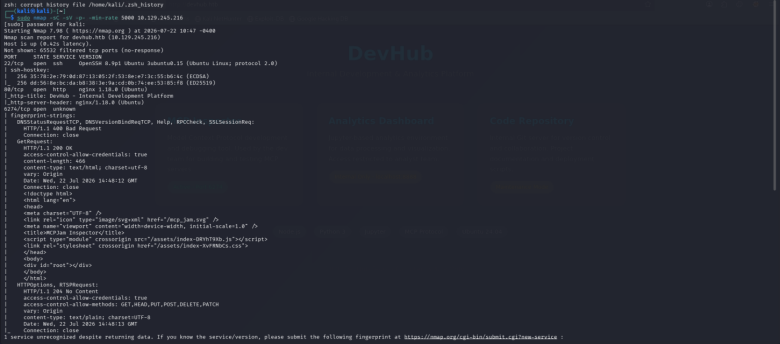 

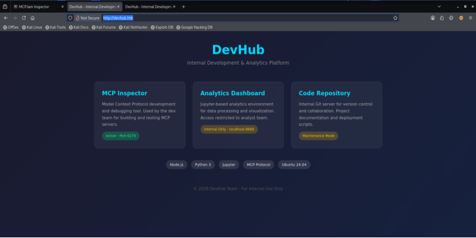
Sau khi truy cập vào giao diện web ta thấy đường dẫn để dẫn đến UI của MCP-inspector trên port 6274 
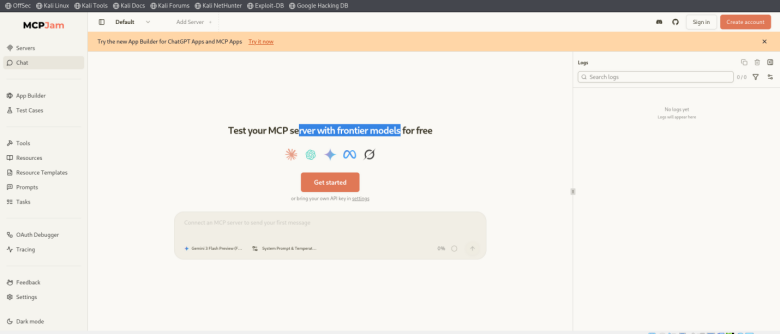
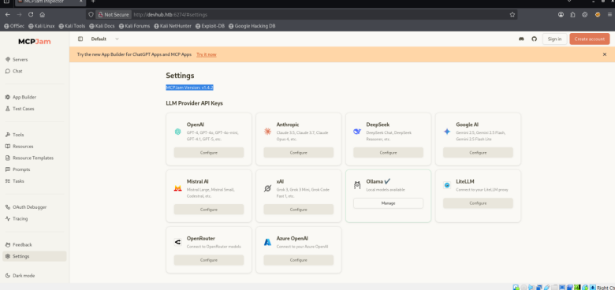
Ta thấy MCP-Jam đang sử dụng là version v1.4.2 và sau khi tìm kiếm trên web tôi đã tìm được CVE-2026-23744 .
Theo mặc định, MCPJam Inspector khi khởi chạy sẽ tự động lắng nghe trên địa chỉ IP 0.0.0.0 thay vì chỉ gói gọn trong 127.0.0.1 (localhost). Điều này khiến dịch vụ kiểm thử vốn dành riêng cho môi trường phát triển nội bộ lại bị lộ ra toàn bộ mạng LAN hoặc Internet. Lập trình viên thiết kế endpoint /api/mcp/connect để nhận cấu hình kết nối tới các máy chủ MCP. Với việc thiếu xác thực (Missing Authentication - CWE-306): Endpoint này không đòi hỏi API Key, Password hay Token xác thực người dùng. Và Không làm sạch tham số, khi nhận một request dạng HTTP POST chứa payload JSON, hệ thống sẽ trích xuất trực tiếp các trường thông tin như command và args rồi chuyển cho hệ điều hành thực thi mà không có bộ lọc an toàn.
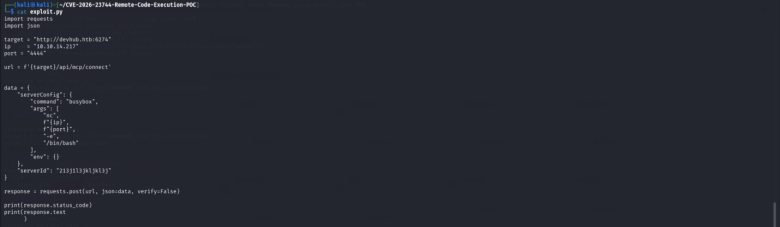

Nhưng khi dùng script khai thác trên github nó đã làm kết nối reverse shell bị đơ và không chạy được. Nên tôi đã thử đổi lệnh reverse sell trong script thành bash 
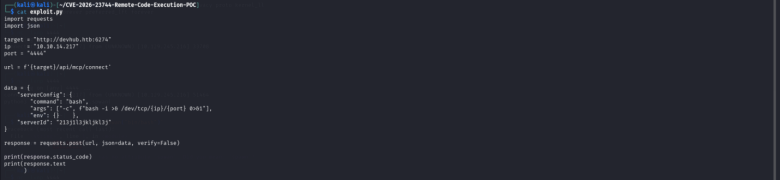
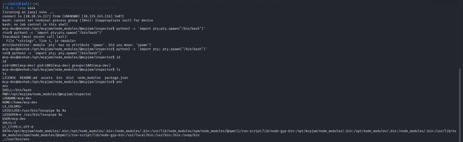
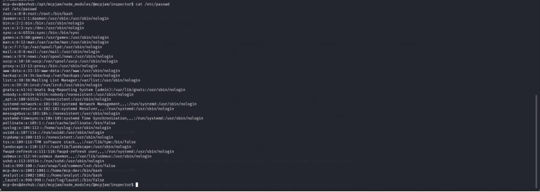
Sau khi vào được tài khoản người dùng `mcp-dev` tôi sẽ xem xét các biến môi trường và file `/etc/passwd` 
Tôi dùng lệnh `ps aux|grep python3'` để liệt kê  các tiến trình có sử dụng python đang chạy trên hệ thống với các tham số :
a: hiển thị tiến trình tất cả người dùng 
u: hiển thị thông tin chi tiết 
x: hiển thị cả các tiến trình chạy ẩn  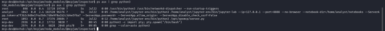
Ở đây chúng ta thấy một dịch vụ là `jupyter-lab`
kèm 
`ServerApp.token=a7f3b2c9d8e1f4a5b6c7d8e9f0a1b2c3d4e5f6a7`
vì nó được khởi chạy từ máy người dùng analyst nên đây sẽ là một đường thông từ tài khoản mcp-dev tới analyst 

Đầu tiên chúng ta sẽ tạo cặp khóa ssh bằng lệnh 
`ssh-keygen -t ed25519 -f pivot_key -C "SSH to PIVOT" -N ""` loại mã hoá ed25519 và no pass-pharse sau đó chúng ta sẽ lấy public key chúng ta vừa tạo
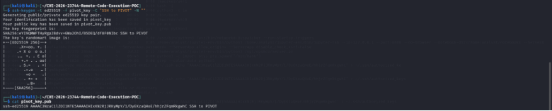

Sau đó quay lại tài khoản user mcp-dev tạo thư mục ẩn .ssh sau đó ghi chuỗi public key vào file `authorized_keys` sau đó cấp quyền đọc và ghi cho chủ sở hữu. 
`mkdir -p ~/.ssh`
`echo "pubkey" > ~/.ssh/authorized_keys`
`chmod 600 ~/.ssh/authorized_keys`
 
chúng ta sẽ ssh lại người dùng mcp-dev với chế dộ Local Port forwarding mở cổng 8888 trên máy kali để  nhận đường truyền từ cổng 127.0.0.1:8888 trên máy devhub.htb sử dụng file private key để xác thực kết nối tới user mcp-dev
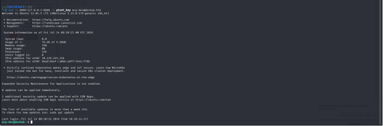 
Hiện giờ chúng ta đã có thể truy cập vào Jupiter lab thông qua web bằng 
`ServerApp.token=a7f3b2c9d8e1f4a5b6c7d8e9f0a1b2c3d4e5f6a7` 
`http://127.0.0.1:8888/?token=a7f3b2c9d8e1f4a5b6c7d8e9f0a1b2c3d4e5f6a7`
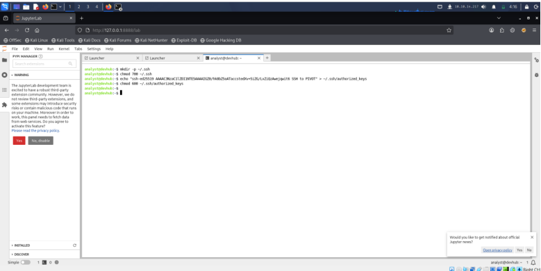
Chúng ta sẽ mở  terminal và thực hiện lại các bước trên để có thể ssh vào được người dùng analyst 
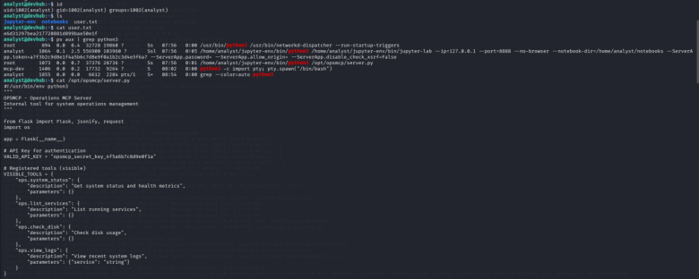
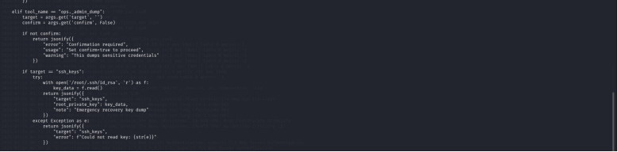

Ở đây sau khi cat đọc file server.py tôi đã tìm được `Valid_API_Key=opsmcp_secret_key_4f5a6b7c8d9e0f1a` để xác thực Web-API .Và 1 tool `ops._admin_dump` nó có thể trích xuất cả những thông tin nhạy cảm bao gồm cả khóa ssh của root và dịch vụ này hoạt dộng trên port 5000 của localhost .
Nên chúng ta sẽ ssh port forwarding lại vào port 5000 localhost của người dùng analyst bằng key mà chúng ta đã tạo trước đó .
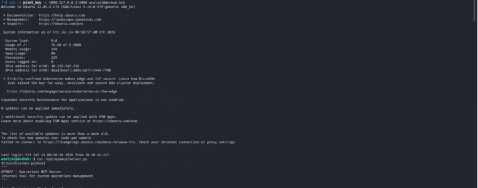
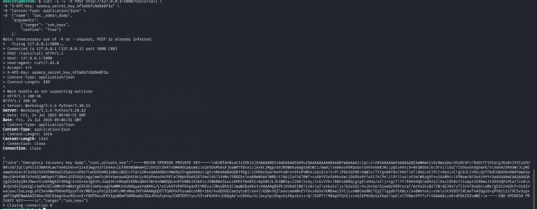
`curl -i -v -X POST http://127.0.0.1:5000/tools/call \
-H "X-API-Key: opsmcp_secret_key_4f5a6b7c8d9e0f1a" \
-H "Content-Type: application/json" \
-d '{"name": "ops._admin_dump",
    "arguments": 
        {"target": "ssh_keys",
        "confirm": "True"}
    }'`

Lệnh này curl với tham số -i và -v sẽ phản hồi http respond và hiển thị chi tiết toàn bộ thông tin trả về và dùng key xác thực bên trên để xác thực  
Kết quả trả về là khoá ssh của private key ssh của ng dùng root 
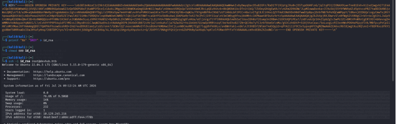
Chúng ta sẽ dùng private key vừa lấy được để xác thực ssh vào ng dùng root
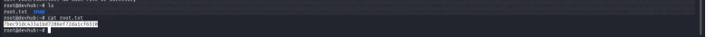

