# Khai thác máy ảo Helix Hackthebox
## Người thực hiện :Trần Minh Đức
### Bước 1: Reconnaissance
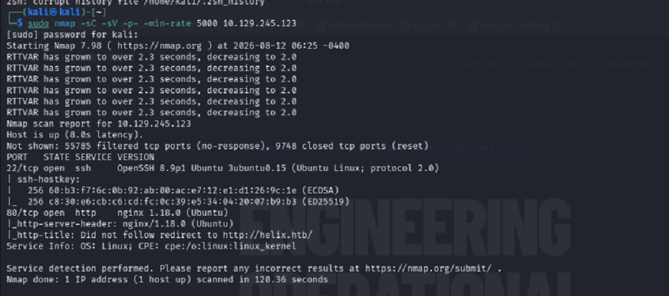
Đầu tiên tôi sử dụng lệnh `sudo nmap -sC -sV -p- -min-rate 5000 <IP mục tiêu>` để thu thập thông tin, version, và các default script trên máy mục tiêu.
Từ kết quả trả về, Ta có các dịch vụ 22/ssh và 80/http sử dụng máy chủ web nginx 1.18.0.
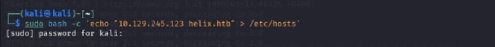
Sau khi ánh xạ địa chỉ IP và miền vào file /etc/hosts ta sẽ tiến hành truy cập vào trang web 
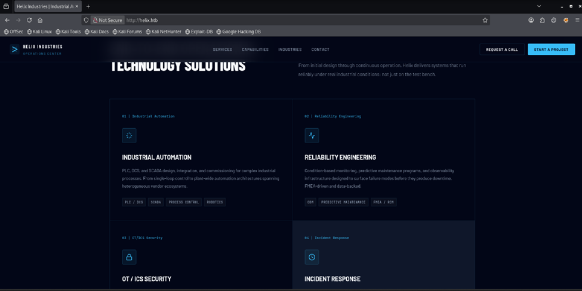
Chúng ta sẽ sử dụng lệnh `ffuf -u http://helix.htb -H "Host: Fuzz.helix.htb" -w /usr/share/wordlists/dirb/common.txt -mc 200 ` để tìm kiếm từ điển common.txt để tìm kiếm subdomain của trang web này và tôi đã tìm được `http://flow.helix.htb`

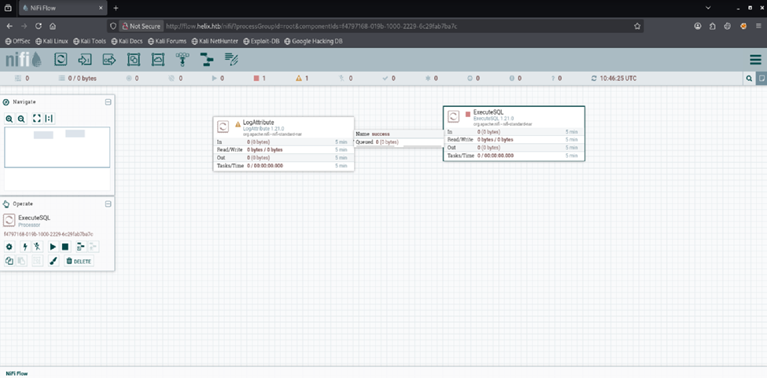
Ta thấy được nó đang chạy dịch vụ Apache Nifi nó là một nền tảng quản lí và xử lí sự trao đổi dữ liệu giữa các hệ thống 
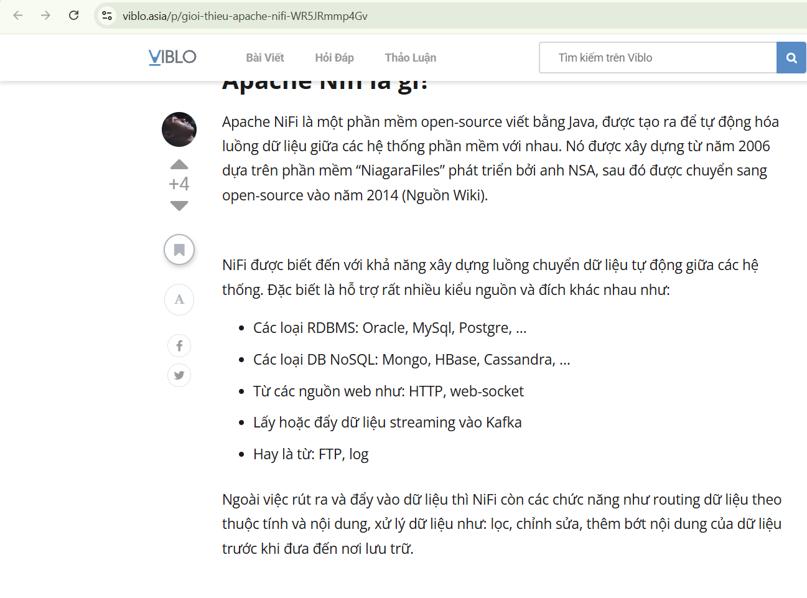
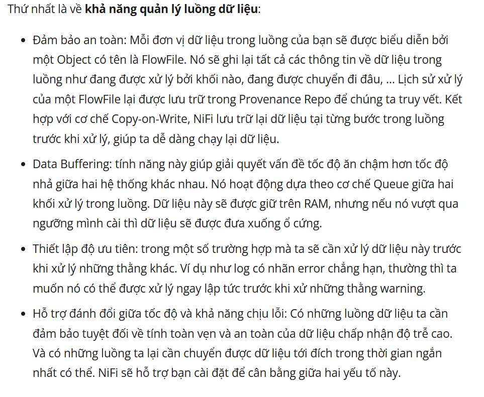
Tôi đã tìm được 1CVE liên quan tới phiên bản `Apache Nifi v1.21.0` là `CVE-2023-34468`
CVE-2023-34468 là một lỗ hổng bảo mật được phát hiện trong Apache NiFi, một công cụ tích hợp và tự động hóa dữ liệu mã nguồn mở được các tổ chức sử dụng để xử lý và phân phối dữ liệu. Lỗ hổng này cho phép thực thi mã từ xa bằng cách khai thác các chuỗi kết nối cơ sở dữ liệu H2 được tạo ra đặc biệt. H2 là một cơ sở dữ liệu nhúng dựa trên Java thường được sử dụng trong cấu hình Apache NiFi.
Đây là chi tiết hơn về CVE này 
`https://www.cyfirma.com/research/apache-nifi-cve-2023-34468-rce-vulnerability-analysis-and-exploitation/`
Đây là link khai thác bằng pdf của nó một cách thủ công :
`https://github.com/mbadanoiu/CVE-2023-34468/blob/main/Apache%20NiFi%20-%20CVE-2023-34468.pdf`
Nhưng cách thực hiện nó khá phức tạp nên tôi sẽ sử dụng 1 đọạn code có sẵn của metasploit để khai thác dễ dàng hơn 
`https://github.com/rapid7/metasploit-framework/blob/master/modules/exploits/multi/http/apache_nifi_processor_rce.rb`
Nó lạm dụng tính năng thiết kế sẵn do cấu hình yếu Không có mã CVE chính thức, vì đây là tính năng hợp lệ của sản phẩm chứ không phải do lỗi lập trình (bug) trong code của Apache NiFi. 
Không có xác thực: Instance NiFi được dựng lên nhưng không bật tính năng bắt đăng nhập/phân quyền .
Quyền hạn quá lớn của Processor: NiFi cung cấp sẵn các Processor như ExecuteProcess hoặc ExecuteStreamCommand cho phép người dùng chạy các lệnh trực tiếp trên hệ điều hành host (OS Commands) nhằm phục vụ xử lý dữ liệu.
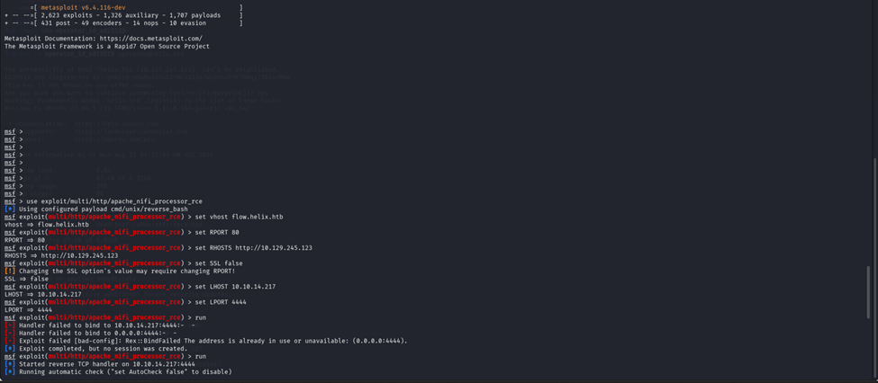
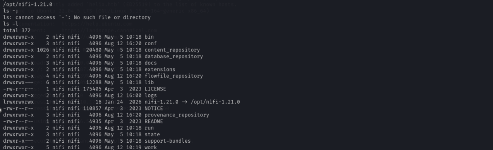
Sau khi bắt reverse shell thành công tôi đã vào được tài khoản người dùng web nifi. Sau khi `ls -l` tôi đã thử 1 vài thư mục và thấy ở trong thư mục support-bundles có 1 file khóa đối xứng của người dùng `operator` 
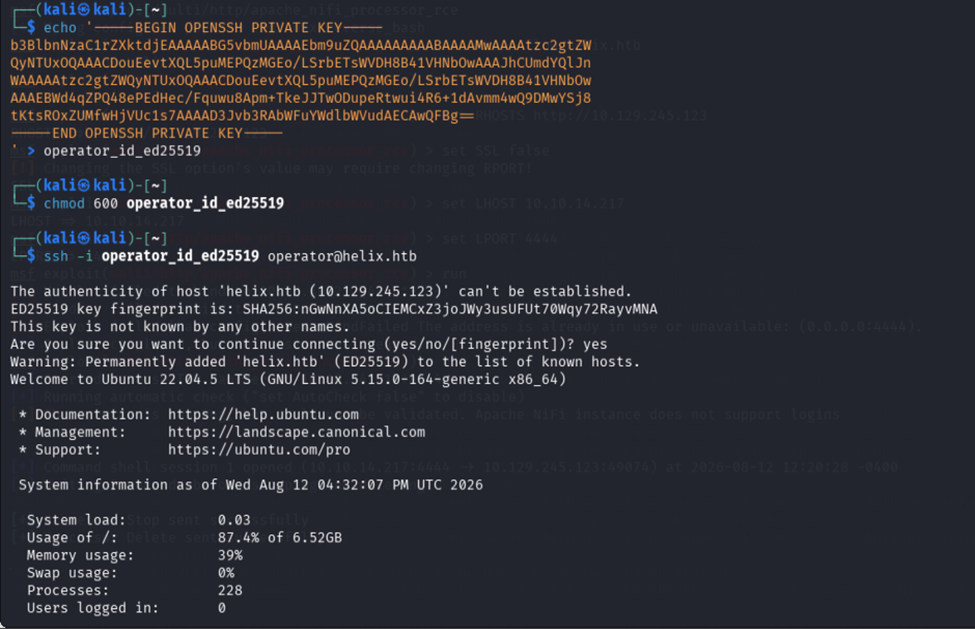
Tôi sẽ lưu file khóa này vào máy tấn công và cấp quyền read và write cho hệ thống và ssh vào người dùng này  
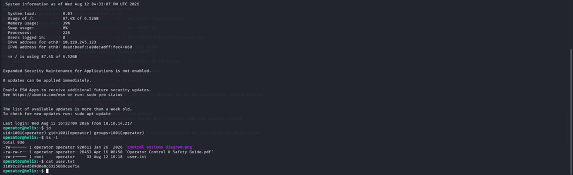
Ở đây tôi đã lấy được file user.txt và khi dùng `ls -l` để hiển thị các file thư mục trong máy tôi đẫ tìm được 1 file pdf và 1 file png 

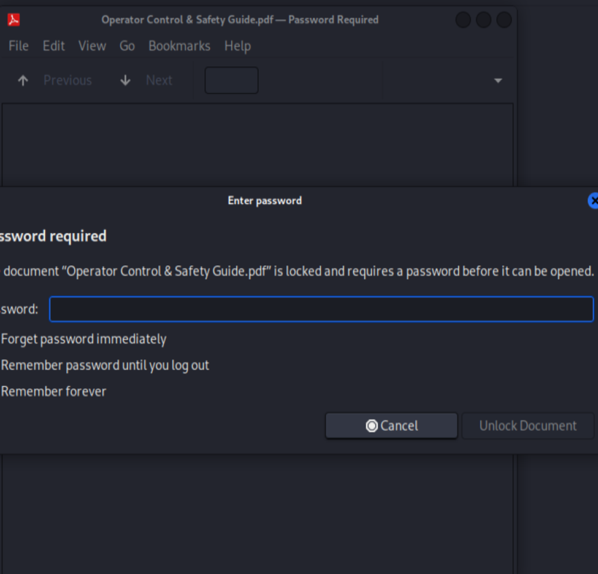
Ở đây file pdf bị lock tôi đã sử dụng  
`pdf2john "Operator Control & Safety Guide.pdf" > pdf.hash` để trích xuất mã hash từ file pdf 
`john --wordlist=/usr/share/wordlists/rockyou.txt pdf.hash` để xử dụng john the ripper để tìm kiếm từ điển `rockyou` và tìm ra password là `operator1`
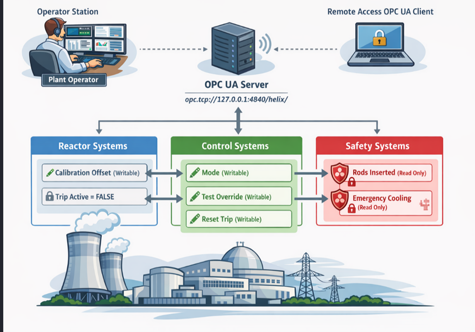
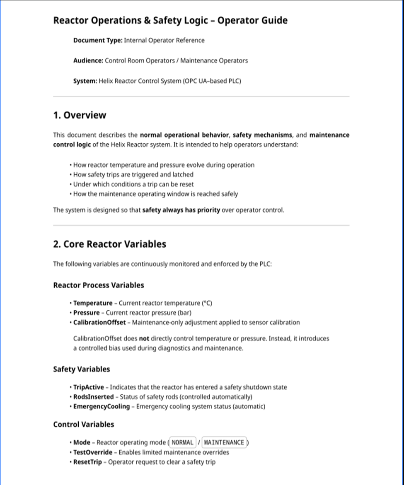
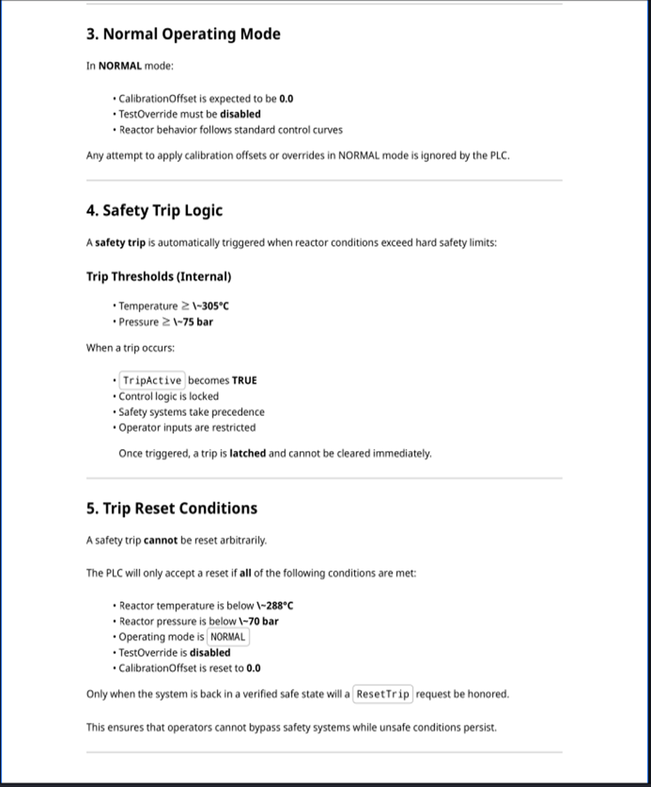
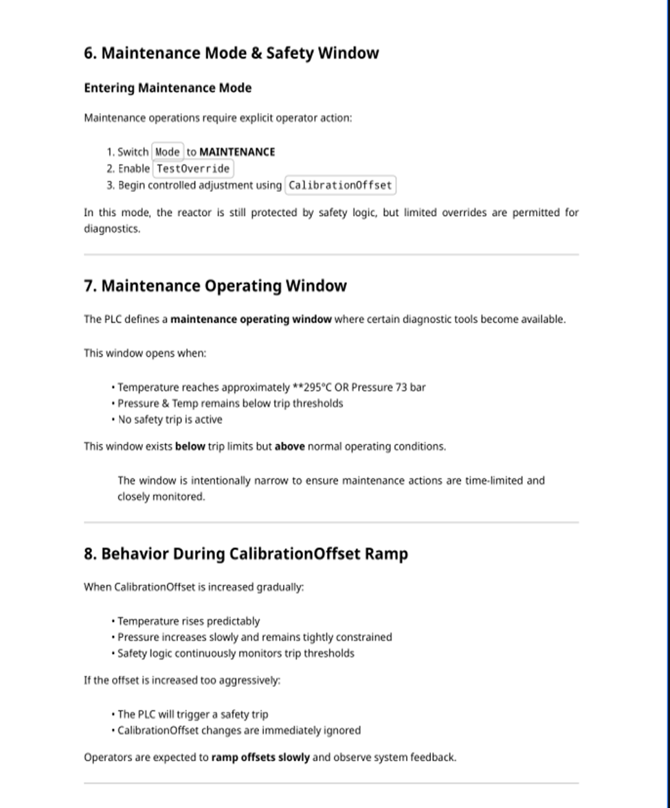
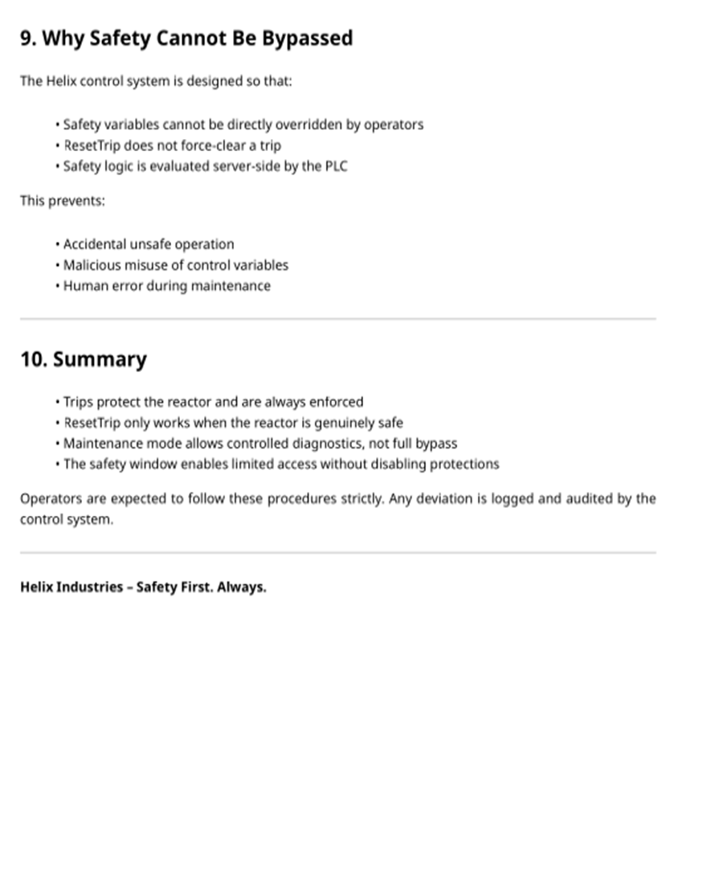
Sau khi `sudo -l` có kết quả 
`User operator may run the following commands on helix:
 (root) NOPASSWD: /usr/local/sbin/helix-maint-console`

 `operator@helix:/tmp$ sudo /usr/local/sbin/helix-maint-console
Maintenance window CLOSED`
Từ đây sau khi đọc tài liệu và muốn leo lên quyền root tô cần setup lại các biến trong của lò phản ứng để có thể kich hoạt được maint-console
Đầu tiên tôi sẽ ssh port fowarding lại vào port 8081 và port 4840 
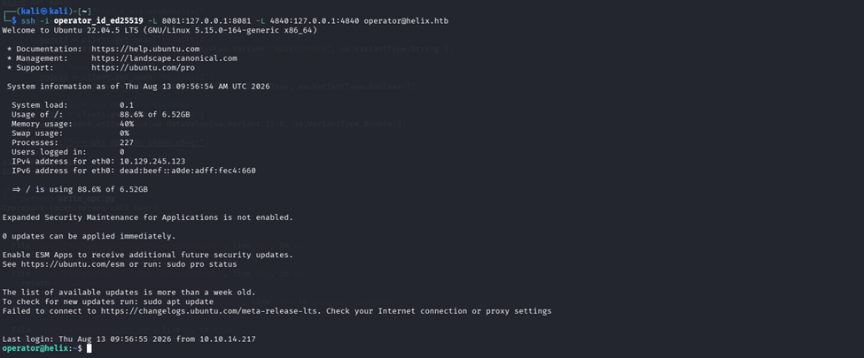
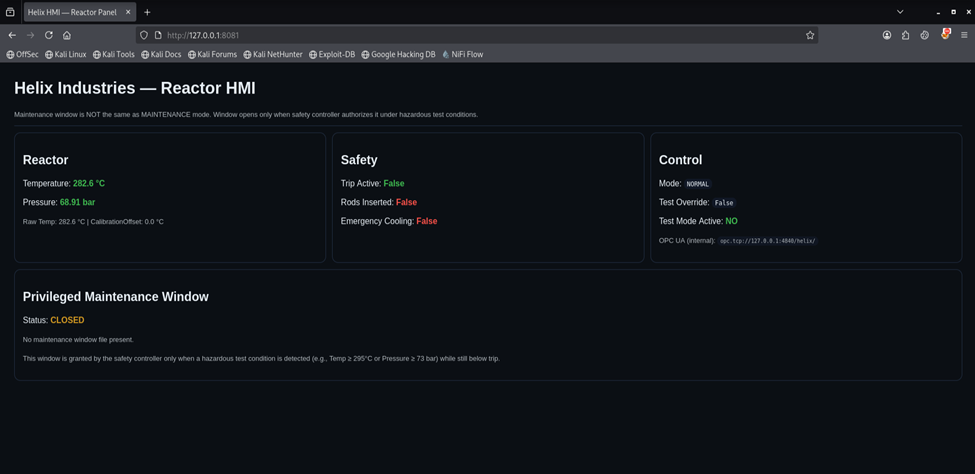
trên cổng 8081  này là giao diện HMI lấy dữ liệu từ OPC UA
để mở được `Privileged Maintenance Window` khi Temperature tăng lên xấp xỉ 295 hoặc Pressure tăng lên xấp xỉ 73.
Để đạt được điều này chúng ta cần phải chuyển:
1. `node:mode` thành `MAINTENANCE`
2. `node: TestOverride = True`
3. `node:CalibrationOffset = 12.0` (Bởi vì nhiệt độ hiện t trên web đang báo của lò là 283 nên để chạm ngưỡng 295 chúng ta cần độ lệch là 12)
4. 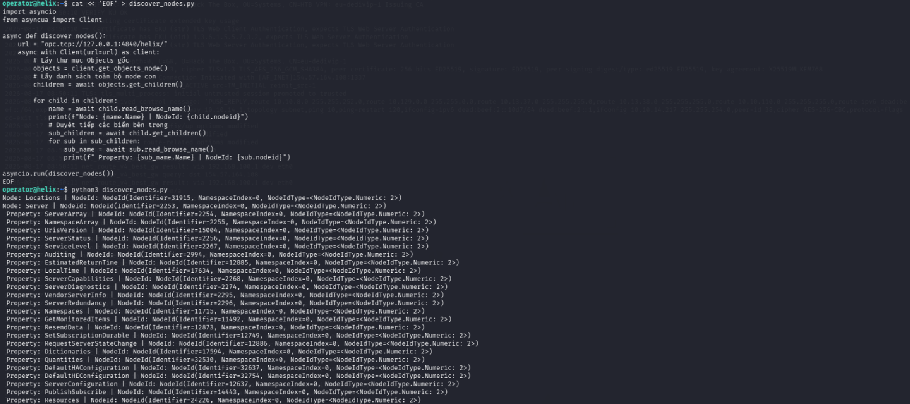
5. 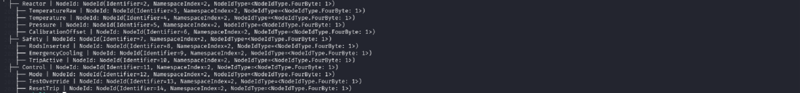

Ta sẽ dùng đoạn code python :
cat << 'EOF' > discover_all.py
import asyncio
from asyncua import Client

async def browse_recursive(node, depth=0):
    try:
        children = await node.get_children()
        for child in children:
            name = await child.read_browse_name()
            indent = "  " * depth
            print(f"{indent} - {name. Name} | NodeId: {child.nodeid}")
            # Duyệt tiếp vào bên trong các folder con
            await browse_recursive(child, depth + 1)
    except Exception:
        pass

async def discover_nodes():
    url = "opc.tcp://127.0.0.1:4840/helix/"
    async with Client(url=url) as client:
        objects = client.get_objects_node()
        print("=== BẮT ĐẦU QUÉT TOÀN BỘ OPC UA TREE ===")
        await browse_recursive(objects)

asyncio.run(discover_nodes())
EOF 

Đoạn code này dùng để hiển thị tên node và node id và namespace index của node để chúng ta có thể dễ dàng sửa chúng 
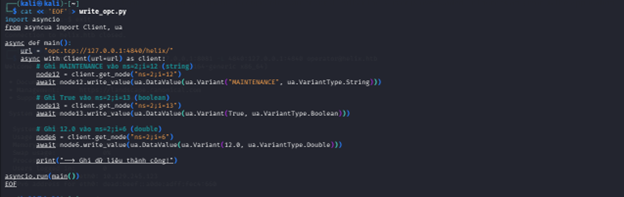
Giờ chúng ta sẽ tiến hành ghi đè vào các biến này 
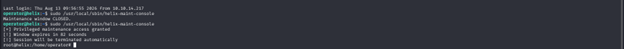
Sau đó chúng ta chỉ cần `sudo /usr/local/sbin/helix-maint-console` là có thể leo lên root
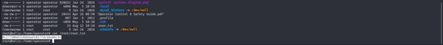

