# Khai thác máy ảo Knife Hackthebox
## Người thực hiện :Trần Minh Đức
### Bước 1: Reconnaissance
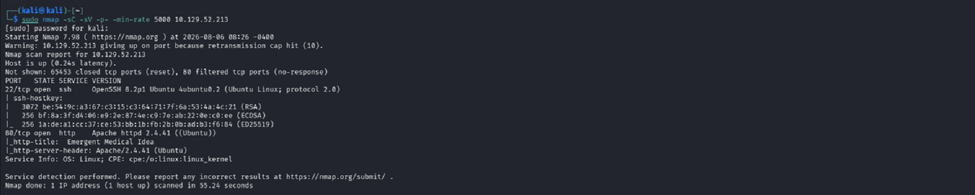
Tôi đã sử dụng lệnh `sudo nmap -sC -sV -p- -min-rate 5000 <IP mục tiêu>` để lấy thông tin về tất cả các port trên máy nạn nhân với các tham số version và các default scrip.
Ở đây, tôi thấy máy này đang sử dụng dịch vụ ssh/22 và http/80. Ở cổng 80 đang sử dụng webserver Apache 2.4.41 có tên title web là Emergent Medical Idea. 
Để truy cập được trang web ta dùng lệnh `sudo bash -c 'echo "<IP mục tiêu > knife.htb" > /etc/hosts'` để ánh xạ ip và tên web. 
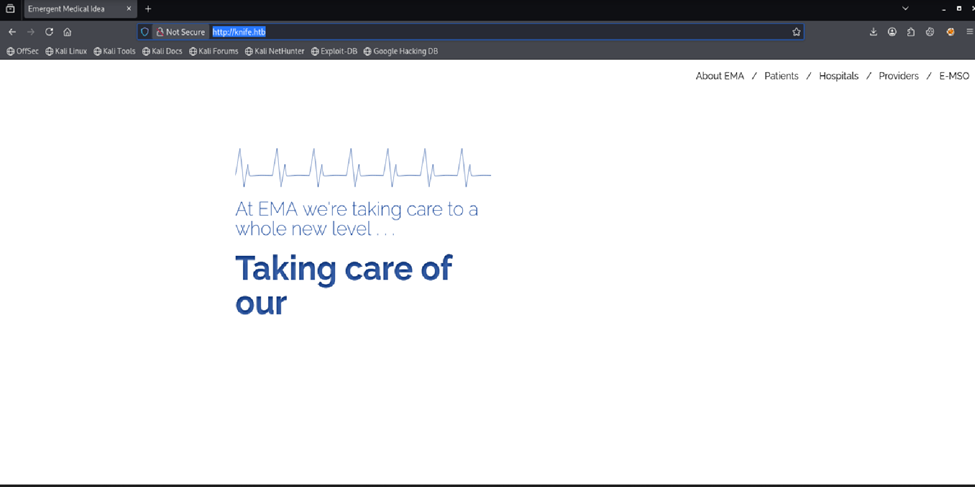
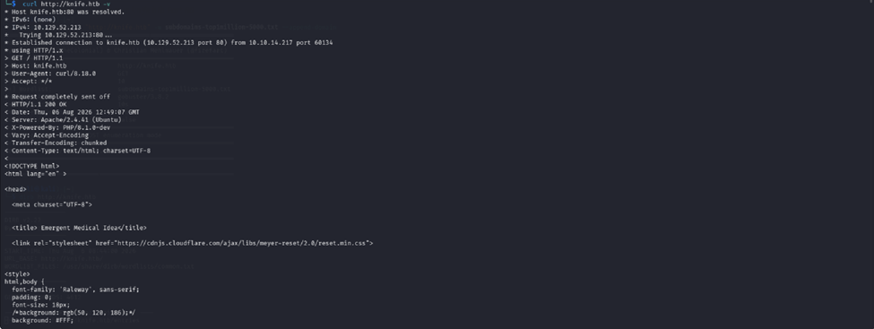
Ở đây, khi tôi sử dụng lệnh curl với tham số verbose `curl <url mục tiêu> -v` . Tôi đã nhận được kết quả trang web này đang sử dụng `PHP/8.1.0-dev` đang mắc một lỗ hổng vô cùng nghiêm trọng.
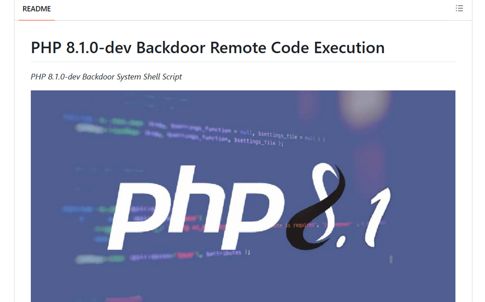
Hai bản cập nhật độc hại đã được đẩy lên kho mã nguồn Git của PHP vào Chủ nhật, ngày 28 tháng 3 năm 2021 , nơi zend_eval_string hàm được gọi, đoạn mã thực chất đã cài đặt một cửa hậu để dễ dàng thực thi mã từ xa (RCE) trên một trang web đang chạy phiên bản PHP bị chiếm quyền này. Dòng này thực thi mã PHP từ bên trong tiêu đề HTTP useragent, nếu chuỗi bắt đầu bằng 'zerodium'.
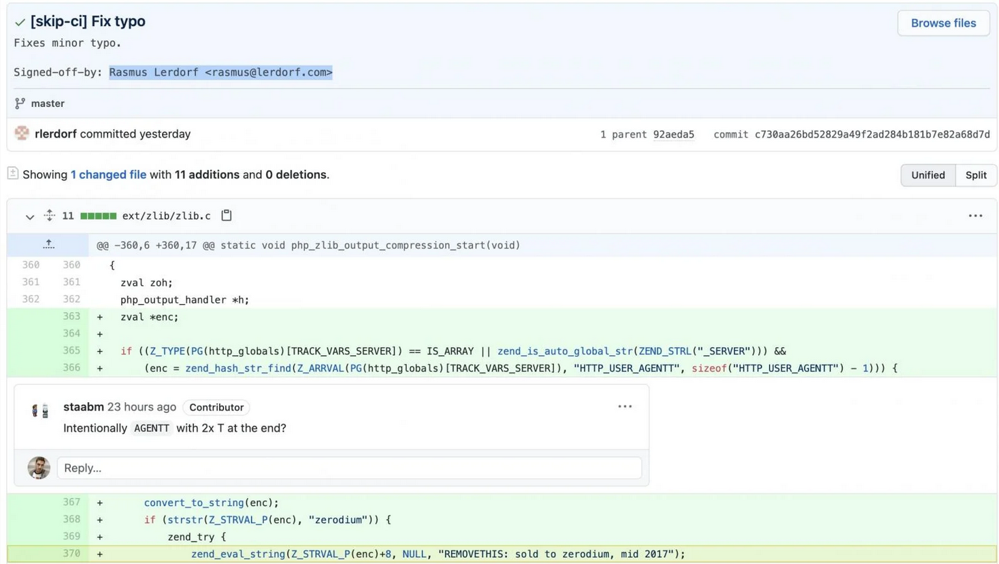
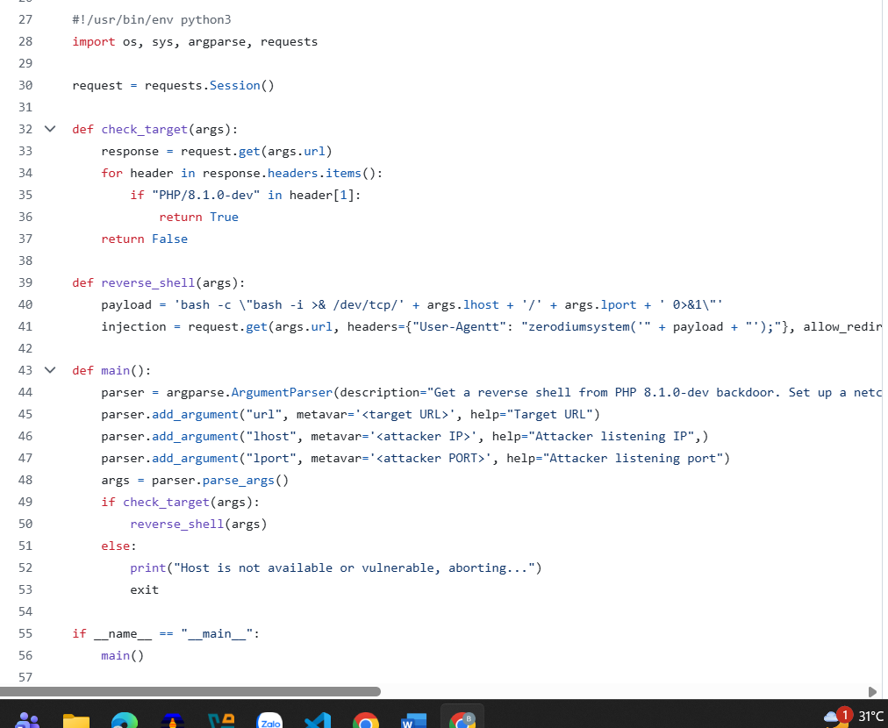
chúng ta sẽ sử dụng đoạn code khai thác này để lấy reverse shell. Ta sẽ git clone về và dùng python3 để chạy script
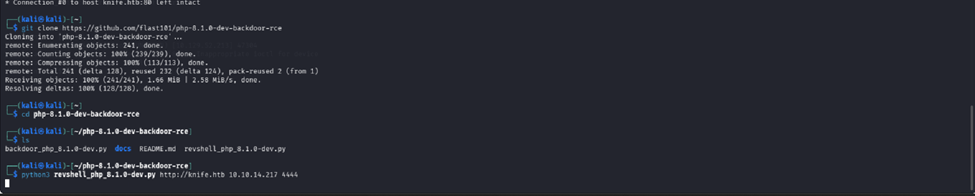
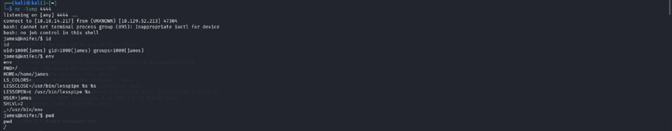    
Sau khi lấy được reverse shell chúng ta sẽ kiểm tra qua id, biến môi trường, và các thư mục hay tệp tin trên máy .
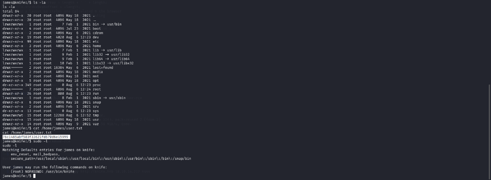
Sau khi dùng lệnh sudo -l để xem quyền user này có quyền gì? Tôi đã phát hiện ra một đường đẫn `/usr/bin/knife` nó được trao quyền root và không cần sử dụng password 
Khi tra cứu thông tin về công cụ này tôi thấy được thông tin về nó là một tool thuộc Chef Workstation là một gói đa công cụ quản lí cấu hình , quét , kiểm thử .... 
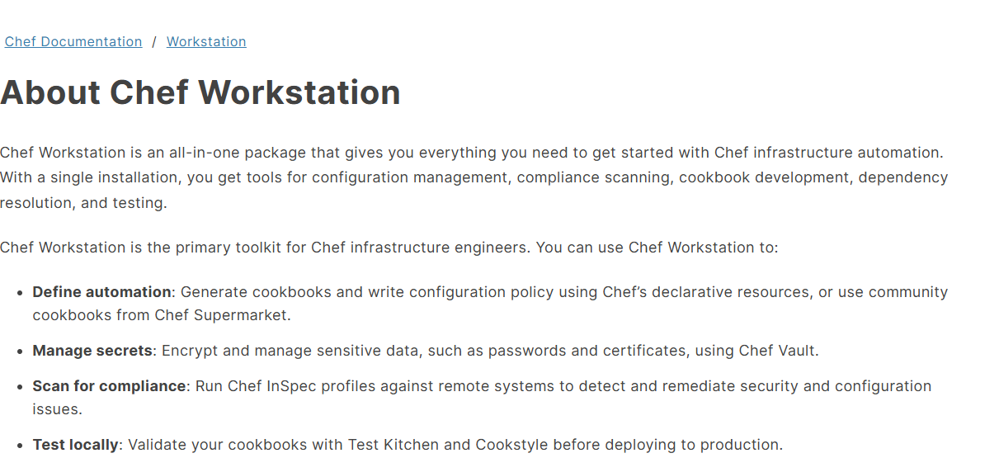
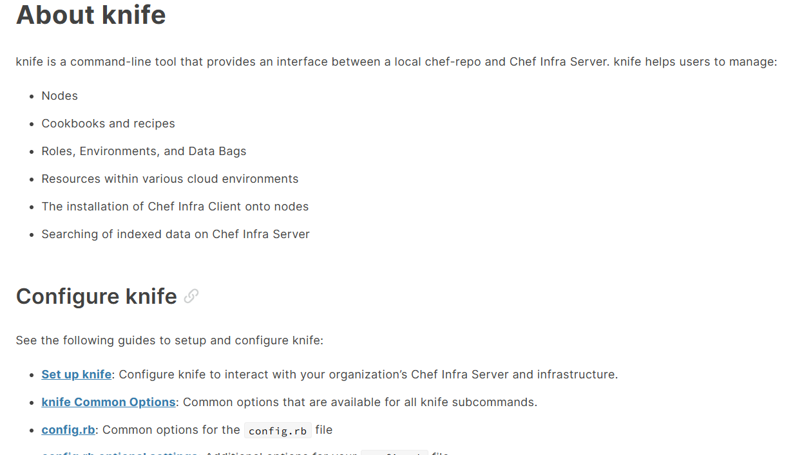
Trong đó, Knife đóng vai trò như một công cụ dòng lệnh cung cấp giao diện giữa kho chef-repo và chef infra server
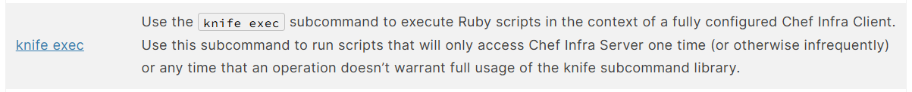
sử dụng nó sẽ giúp chúng ta thực hiện tập lệnh ruby. Và với quyền root đã được trao bên trên nó sẽ giúp chúng ta leo lên root bằng dòng lệnh gọi  `bin/sh`
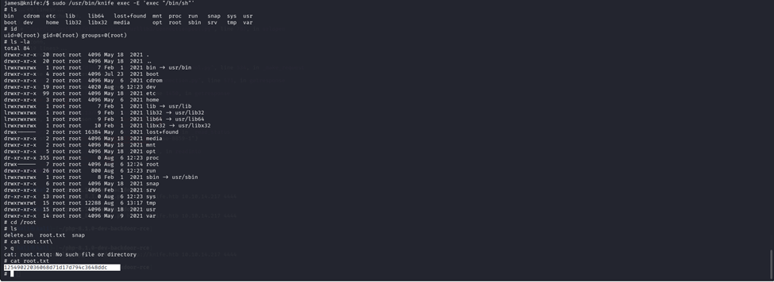
