# Khai thác máy ảo Wifinetic Hackthebox
## Người thực hiện :Trần Minh Đức
### Bước 1: Reconnaissance

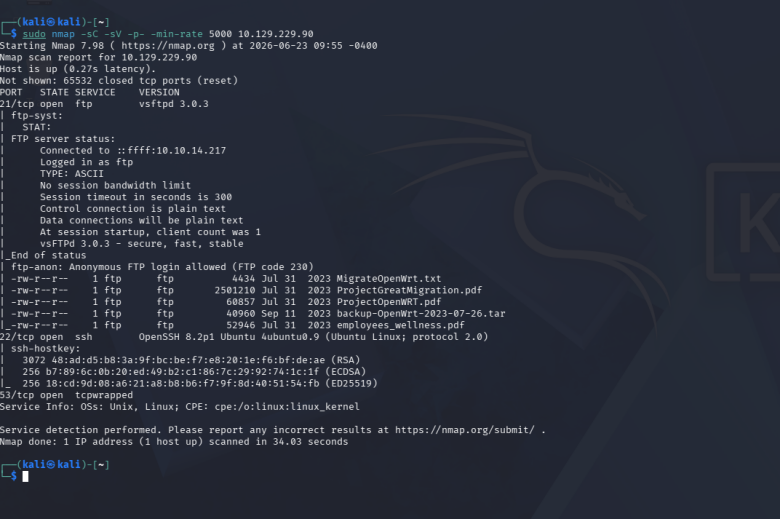

Đầu tiên, tôi sẽ chạy lệnh 
`sudo nmap -Sc -Sv -p- -min-rate 5000 <ip mục tiêu>` 
Lệnh này sẽ giúp chúng ta quét tất cả các port và tên dịch vụ phiên bản và các default script trên máy nạn nhân.

Chúng ta nhận được kết quả trả về là 3 cổng dịch vụ 21/ftp, 22/ssh và 53/dns nhưng cổng này đã bị chặn truy cập trả về kết quả là tcpwrapped.

Từ những kết quả được trả về ta thấy ở cổng dịch vụ ftp có dòng `ftp-anon: Anonymous FTP login allowed (FTP code 230)`. Điều này có nghĩa là cổng ftp này cho phép bất kì ai cũng có thể truy cập vào cổng dịch vụ này dưới tên `anonymous` . Và ta còn nhận được kết quả có 5 tệp tin công khai trong vùng chia sẻ gồm 4 file txt,pdf và 1 file cấu hình đang nén. 

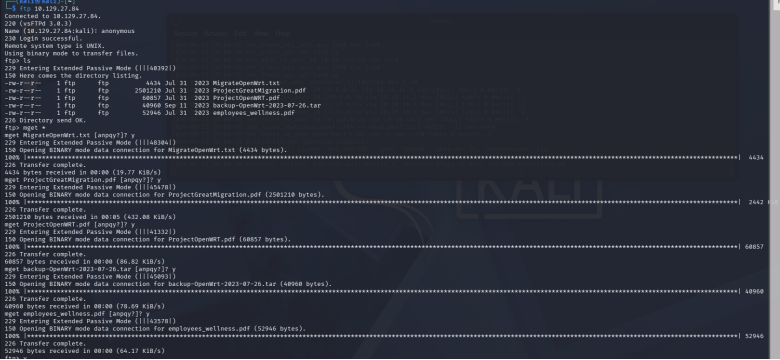

Sau khi kết nối dịch vụ FTP thành công tôi sẽ tiến hành download tất cả các file này về máy . 

Khi đã tải xong tôi sẽ giải nén tệp file cấu hình và bắt đầu xem qua lần lượt từng file 

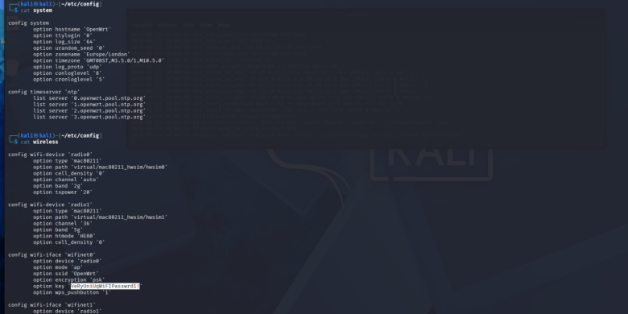

Tôi đã phát hiện ra được password `VeRyUniUqWiFIPasswrd1!` của 2 giao diện mạng `wifinet 0 và wifinet 1` hoạt động ở mode accesspoint là 1 chạm phát sóng cho máy khác 

Khi lấy được password rồi chúng ta sẽ check qua file passwd để lấy thông tin về các user trên hệ thống để có thể thử truy cập bằng passwd vừa tìm được 

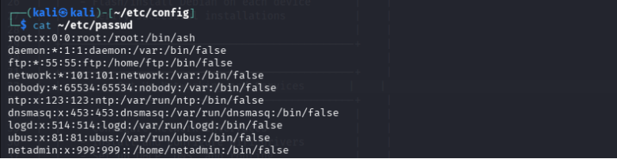

Ta thấy sẽ có 2 tài khoản user là `root` và `netadmin` là 2 user thật 

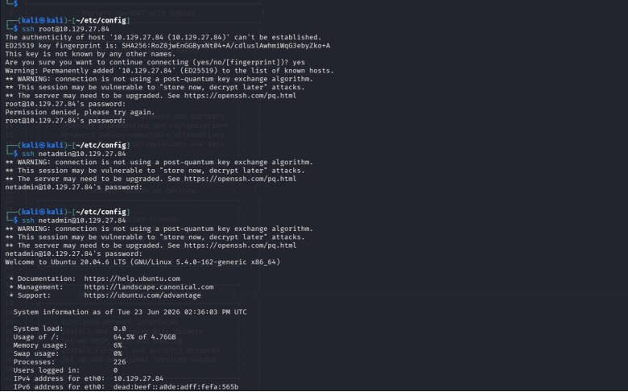

Sau khi ssh thử bằng 2 tài khoản bằng passwd trên ta đã vào được tài khoản user `netadmin` 

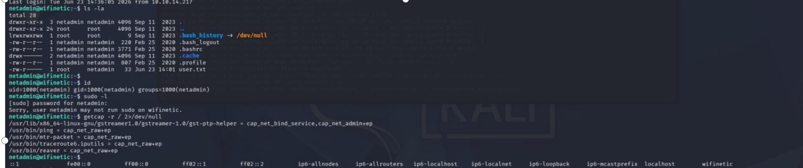

Khi ssh thành công, chúng ta sẽ sử dụng các lệnh để xem các quyền mà user này sở hữu. Tôi đã dùng lệnh
`getcap -r / 2>/dev/null`

 Lệnh này sẽ hiển thị các đặc quyền được
 gán cho các tệp tin thực thi .Ở đây,tôi tìm được `reaver` nó là một công cụ được thiết kế chuyên biệt để tấn công và bẻ khóa mật khẩu Wi-Fi bằng cách khai thác lỗ hổng trong tính năng WPS.
 Với giao thức WPS nó được thiết kế với việc sẽ băm nửa đầu và sẽ gửi đến router để kiểm tra 4 số đầu của mã pin và nếu đúng reaver sẽ gửi phần còn lại để router kiểm tra . Thay vì việc băm cả 8 chữ số rồi mới gửi với 10^8 trường hợp nhờ lỗ hổng này của WPS đã giúp reaver chỉ p kiểm tra 10^4+10^3 
 
Trường hợp và ở đây nó còn được trao quyền `cap_net_raw+ep` nó cho phép một chương trình thông thường mang quyền của root can thiệp sâu vào mạng ở tầng thô  tạo ra một raw socket, packet socket hay đọc dữ liệu qua card mạng 

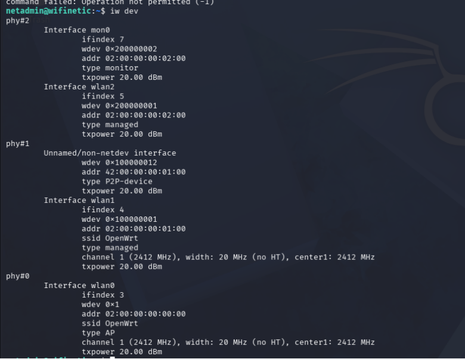

ta sẽ dùng lệnh iw dev để xem thông tin các interfaces được gắn vào chip wifi vật lí 

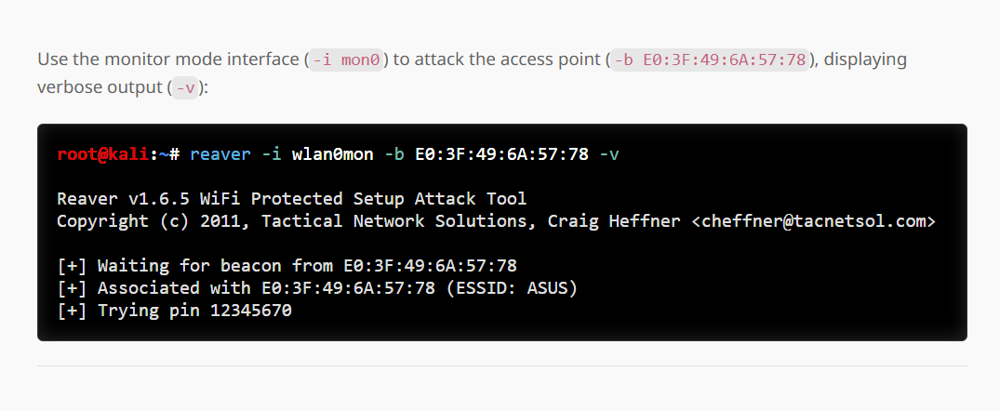 

từ hướng dẫn sử dụng reaver ta sẽ dùng lệnh 
`reaver -i mon0 -b 02:00:00:00:00:00 -vv`

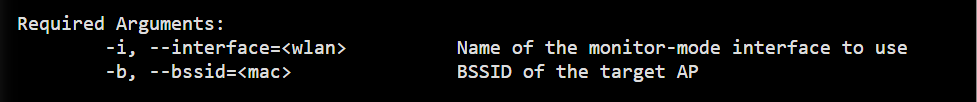
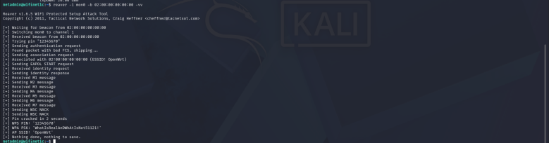

Reaver đã trả về WPA PSK `WhatIsRealAnDWhAtIsNot51121!`
Sau đó tôi sử dụng `su -` để yêu cầu chuyển sang tài khoản root và dùng pass trên để login 

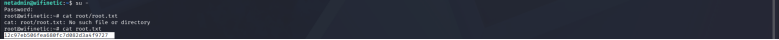
